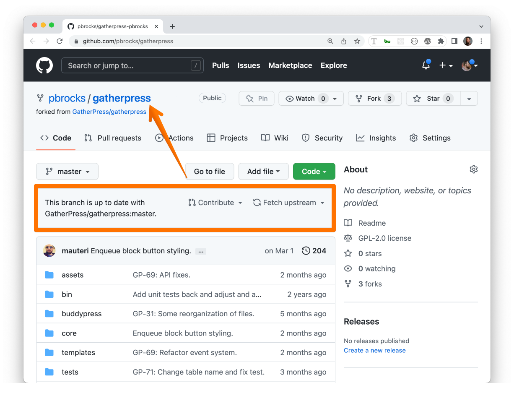

# GatherPress

## 🎖️ The Goal

GatherPress is the result of the WordPress community's desire for new event management tools that meet the diverse needs of event organizers and members.

## 📃 The Project

This project is for the collaborative effort to build a compelling event management application using open source tools such as _WordPress_ and _BuddyPress_ and the grit sweat and love of **the community, for the community**.

We're creating the very network features we need to host events and gather well.

### 🤝 How to Get Involved

If you wish to share in the collaborative of work to build _GatherPress_, please drop us a line either via [WordPress Slack](https://make.wordpress.org/chat/) or on [GatherPress.org](htps://gatherpress.org/get-involved).

### 🔑 Collaborator Access

**GitHub Administrators**
> [Mervin Hernandez](https://github.com/MervinHernandez) and [Mike Auteri](https://github.com/mauteri)

**GatherPress.org**
> Talk to Mervin for access to `gatherpress.org` via SSH and WP Admin login.

# Credits
[mauteri](https://profiles.wordpress.org/mauteri/), [hrmervin](https://profiles.wordpress.org/hrmervin/), [pbrocks](https://profiles.wordpress.org/pbrocks/), [jmarx](https://profiles.wordpress.org/jmarx/), [hauvong](https://profiles.wordpress.org/hauvong/), [prashantabellad](https://profiles.wordpress.org/prashantabellad/), [prayagm](https://profiles.wordpress.org/prayagm/), [patricia70](https://profiles.wordpress.org/patricia70/), [meaganhanes](https://profiles.wordpress.org/meaganhanes/), [calebthedev](https://profiles.wordpress.org/calebthedev/), [cameronbarrett](https://profiles.wordpress.org/cameronbarrett/), [courane01](https://profiles.wordpress.org/courane01/), [newyorkerlaura](https://profiles.wordpress.org/newyorkerlaura/), [phoopee3](https://profiles.wordpress.org/phoopee3/)

---

# [WIP] Documentation Outline

## Features

- Event Scheduling: set dates, times, and provide event information details.
- Attendee registration.
- Emailing system: to send emails to all the group members, or a specific event attendees, non-attendees, and those on the waiting list.
- In person events: add the venue, with an optional map (refer to point 4)
- Online event management: add the video meeting URL.
- Multi-event management: capability to handle multiple events simultaneously.
- Multisite environment: This setup allows for centralized management while providing flexibility for each site to host its own unique events with its settings (language, timezone, date time format) and set of users. 
- Works with blocks. 
- Fully internationalized.
- Freedom to add content besides the default event/venue blocks, to remove default blocks, and add synced patterns (useful for adding consistent information across all events).

## Upcoming features

- Ability for attendees to be listed anonymously (only administrators will see their names).
- Allow attendees to add guests.
- Import events from meetup.com with an addon plugin (currently in development).
- Recurring events.
- Calendar block.
- Email notification when event starts.

## How to Use

### 1. Setup
1. Download the plugin: you'll find the latest release on the GatherPress GitHub repository, under Releases > Assets and download gatherpress.zip.
2. Install it in your WordPress instance: go to WP Admin Plugins > Add new plugin. Choose the gatherpress.zip file you just downloaded.
3. Activate the plugin.

### 2. Settings
Go to WP Admin > GatherPress  > Settings.

You can change different settings such as:
- Show publish date as event date for events.
- The default maximum limit of attendees to an event.
- Date Format.
- Time Format.
- Display the timezone for scheduled events.
- Upcoming Events page.
- Past Events page.

### 3. Create an Event
Go to the WP Admin > Events > Add new

By default, a few blocks are populated, you can keep them or delete them, you can add more blocks.

- The Event date block allows you to define the start and end dates and times of your event, as well as the timezone.
- The Add to Calendar block enables your users to add the event to their preferred calendar directly from the published event on the frontend
- The Venue block lets you choose whether your event is online or in a venue. You can select the venue (refer to point 4) and the map settings: display, zoom level, type of map and map height.
- The RSVP block enables members to easily confirm they attend or do not attend an event.
- The description of the event is a normal paragraph block. You can add anything with any block here.
- The RSVP Response block displays a list of members who have confirmed they attend or do not attend an event. 

### 4. Venues
Go to WP Admin > GatherPress  > Venues

In the Venue block, you can define:
- The full address, telephone and website of the venue.
- The map settings.

### 5. Topics
Go to WP Admin > GatherPress  > Topics

Topics are like post categories, but for events.

# Developer Documentation

## .wp-env

If you have Docker installed, you could use wp-env package to load a WordPress development environment with this plugin automatically activated.

### To setup this repo for local dev

#### Fork this repository

Although you can download a zip file of the plugin at:

```
https://github.com/GatherPress/gatherpress
```

If you want to help out with development, we suggest forking the code to your own Github repository and creating a branch from there.

#### Clone this repository

Once you've forked the repo, you should now have a mirrored copy of GatherPress, but on your profile's URL, or something like this:

```
https://github.com/YourGithubUsername/gatherpress
```

where `YourGithubUsername` corresponds to your login name for Github.

To clone a local copy, open a terminal window and run the following command:

```sh
git clone git@github.com:YourGithubUsername/gatherpress.git
```

if you have your SSH keys set up. If not, run:

```sh
git clone https://github.com/YourGithubUsername/gatherpress.git
```

##### Note about customizing the URL

Once you have forked the GatherPress repo, you can also change the folder name of your version of the repository by going into your settings of your repo on Github's website.

```
https://github.com/pbrocks/gatherpress
```



### Install wp-env globally

In a terminal window, run:

```sh
npm i -g @wordpress/env
```

#### Change directory and run wp-env

In your terminal window, run:

```sh
cd gatherpress
wp-env start
```

You should then see that a development site has been configured for you on localhost port 2003


#### Log in to Site / Log into Site


#### Development Site Plugins/Themes

To further customize the development site using your favorite or most familiar development plugins or themes, you are able to add whatever you like because of this code added to the `.wp-env.json` file:

```json
 "mappings": {
    "wp-content/plugins": "./wp-core/plugins",
    "wp-content/themes": "./wp-core/themes"
 },
 ```

In fact, after the initial setup, you may notice that in your code editor, there is now a `wp-core` folder containing the default plugins and themes, but it is grayed out, so the contents of this folder will not be committed to the GatherPress repository.


#### To shut down your development session

Simply run:

```sh
wp-env stop
```

For more info on wp-env package, consult the [Block Handbook's page](https://developer.wordpress.org/block-editor/reference-guides/packages/packages-env/).
