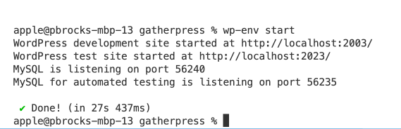
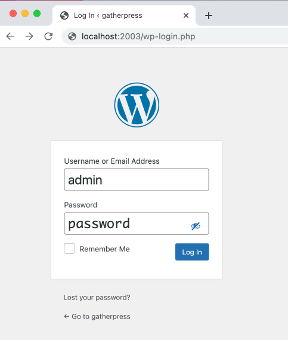
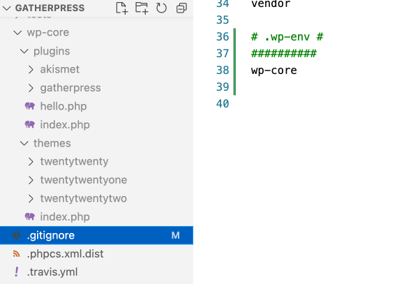

# GatherPress

> GatherPress, powering our community's event management needs.

 [](https://github.com/GatherPress/gatherpress/actions/workflows/coding-standards.yml) [](https://github.com/GatherPress/gatherpress/actions/workflows/phpunit-tests.yml) [](https://github.com/GatherPress/gatherpress/actions/workflows/jest-tests.yml) [](https://github.com/GatherPress/gatherpress/actions/workflows/e2e-tests.yml) [](https://github.com/GatherPress/gatherpress/actions/workflows/sonarcloud.yml) [](https://github.com/GatherPress/gatherpress/actions/workflows/dependency-review.yml)

[](https://github.com/GatherPress/gatherpress/actions/workflows/wp-plugin-check-action.yml)

    [](https://github.com/GatherPress/gatherpress/actions/workflows/wordpress-version-checker.yml)

  

## Overview

GatherPress, a plugin created by and for the WordPress community, is a response to the community's desire for novel event management tools that meet the diverse needs of event organizers and members. Its agenda and roadmap align with that of the WordPress community, ensuring that it evolves in tandem with our collective wants and needs.

This project is for the collaborative effort to build a compelling event management application using open source tools such as _WordPress_ and _BuddyPress_ and the grit sweat and love of **the community, for the community**.

We're creating the very network features we need to host events and gather well.


## Features

- Event Scheduling: set dates, times, and provide event information details.
- Attendee registration.
- Ability for attendees to be listed anonymously (only administrators will see their names).
- Emailing system: to send emails to all the group members, or a specific event attendees, non-attendees, and those on the waiting list.
- In person events: add the venue, with an optional map (refer to point 4)
- Online event management: add the video meeting URL.
- Multi-event management: capability to handle multiple events simultaneously.
- Multisite environment: This setup allows for centralized management while providing flexibility for each site to host its own unique events with its settings (language, timezone, date time format) and set of users.
- Works with blocks.
- Fully internationalized.
- Freedom to add content besides the default event/venue blocks, to remove default blocks, and add synced patterns (useful for adding consistent information across all events).

### Upcoming features

- Allow attendees to add guests.
- Import events from meetup.com with an add-on plugin (currently in development).
- Recurring events.
- Calendar block.
- Email notification when event starts.

## Requirements

To run GatherPress, we recommend your host supports:

- PHP version 7.4 or greater.
- MySQL version 5.6 or greater, or, MariaDB version 10.0 or greather.
- HTTPS support.

## Installation

1. Download the plugin: you'll find the latest release on the GatherPress GitHub repository, under [Releases](https://github.com/GatherPress/gatherpress/releases) > Assets and download `gatherpress.zip`.
2. Install it in your WordPress instance: go to WP Admin Plugins > Add new plugin. Choose the `gatherpress.zip` file you just downloaded.
3. Activate the plugin.

## How to Use

### Configure GatherPress

In WP Admin, go to `Events`  > `Settings`.

You can change different settings such as:
- Show publish date as event date for events.
- The default maximum limit of attendees to an event.
- Anonymous RSVP.
- Date Format.
- Time Format.
- Display the timezone for scheduled events.
- Upcoming Events page.
- Past Events page.

### Create an Event

In WP Admin, go to `Events` > `Add New`.

By default, a few blocks are populated, you can keep them or delete them and you can add more blocks.

- The Event date block allows you to define the start and end dates and times of your event, as well as the timezone.
- The Add to Calendar block enables your users to add the event to their preferred calendar directly from the published event on the frontend.
- The Venue block lets you choose whether your event is online or in a venue. You can select the venue (refer to point 4) and the map settings: display, zoom level, type of map and map height.
- The RSVP block enables members to confirm they attend or do not attend an event.
- The description of the event is a normal paragraph block. You can add anything with any block here.
- The RSVP Response block displays a list of members who have confirmed they attend or do not attend an event.
- The event settings allow you to modify all the above mentioned settings, enable or disable anonymous RSVP, choose Topics, notify members or attendees, as well as standard WordPress settings such as the featured image, the excerpt, allow or disallow comments, etc.

### Create a Venue

In WP Admin, go to `Events` > `Venues`.

In the Venue block, you can define:
- The full address, telephone, and website of the venue.
- The map settings.

### Create an Event Topic

In WP Admin, go to `Events`  > `Topics`.

Topics are like post categories, but for events.

## Contribute

If you wish to share in the collaborative of work to build _GatherPress_, please drop us a line either via [WordPress Slack](https://make.wordpress.org/chat/) or on [GatherPress.org](htps://gatherpress.org/get-involved). The development location of the GatherPress project can be found at [https://github.com/gatherpress/gatherpress](https://github.com/gatherpress/gatherpress). All contributions are welcome: code, design, user interface, documentation, translation, and more.

### Collaborator Access

To get write access to the GitHub repo, please reach out to our **GitHub Administrators**: [Mervin Hernandez](https://github.com/MervinHernandez) and [Mike Auteri](https://github.com/mauteri).

To get access to [GatherPress.org](htps://gatherpress.org/get-involved) via SSH or WP Admin login, please reach out to our **GatherPress.org Administrator**: [Mervin Hernandez](https://github.com/MervinHernandez).

## Developer Documentation

### .wp-env

If you have Docker installed, you could use the `wp-env` package to load a WordPress development environment with this plugin automatically activated.

### Local Development

#### Fork this repository

Although you can download a zip file of the plugin at:

```
https://github.com/GatherPress/gatherpress
```

If you want to help out with development, we suggest forking the code to your own Github repository and creating a branch from there.

#### Clone this repository

Once you've forked the repo, you should now have a mirrored copy of GatherPress, but on your profile's URL, or something like this:

```
https://github.com/YourGithubUsername/gatherpress
```

where `YourGithubUsername` corresponds to your login name for Github.

To clone a local copy, open a terminal window and run the following command:

```sh
git clone git@github.com:YourGithubUsername/gatherpress.git
```

if you have your SSH keys set up. If not, run:

```sh
git clone https://github.com/YourGithubUsername/gatherpress.git
```

##### Note about customizing the URL

Once you have forked the GatherPress repo, you can also change the folder name of your version of the repository by going into your settings of your repo on Github's website.

```
https://github.com/pbrocks/gatherpress
```


### Install wp-env globally

In a terminal window, run:

```sh
npm i -g @wordpress/env
```

#### Change directory and run wp-env

In your terminal window, run:

```sh
cd gatherpress
wp-env start
```

You should then see that a development site has been configured for you on localhost port 2003



#### Log in to Site / Log into Site



#### Development Site Plugins/Themes

To further customize the development site using your favorite or most familiar development plugins or themes, you are able to add whatever you like because of this code added to the `.wp-env.json` file:

```json
 "mappings": {
    "wp-content/plugins": "./wp-core/plugins",
    "wp-content/themes": "./wp-core/themes"
 },
 ```

In fact, after the initial setup, you may notice that in your code editor, there is now a `wp-core` folder containing the default plugins and themes, but it is grayed out, so the contents of this folder will not be committed to the GatherPress repository.



#### To shut down your development session

Simply run:

```sh
wp-env stop
```

For more info on wp-env package, consult the [Block Handbook's page](https://developer.wordpress.org/block-editor/reference-guides/packages/packages-env/).

## Credits

Thanks to the following folks for contributing to GatherPress:
[mauteri](https://profiles.wordpress.org/mauteri/), [hrmervin](https://profiles.wordpress.org/hrmervin/), [pbrocks](https://profiles.wordpress.org/pbrocks/), [jmarx](https://profiles.wordpress.org/jmarx/), [prashantabellad](https://profiles.wordpress.org/prashantabellad/), [prayagm](https://profiles.wordpress.org/prayagm/), [patricia70](https://profiles.wordpress.org/patricia70/), [meaganhanes](https://profiles.wordpress.org/meaganhanes/), [calebthedev](https://profiles.wordpress.org/calebthedev/), [javiercasares](https://profiles.wordpress.org/javiercasares/), [linusx007](https://profiles.wordpress.org/linusx007/), [cameronbarrett](https://profiles.wordpress.org/cameronbarrett/), [courane01](https://profiles.wordpress.org/courane01/), [newyorkerlaura](https://profiles.wordpress.org/newyorkerlaura/), [phoopee3](https://profiles.wordpress.org/phoopee3/), [hauvong](https://profiles.wordpress.org/hauvong/), [deshabhishek007](https://profiles.wordpress.org/deshabhishek007/), [jeffpaul](https://profiles.wordpress.org/jeffpaul/), [michelleames](https://profiles.wordpress.org/michelleames/)
