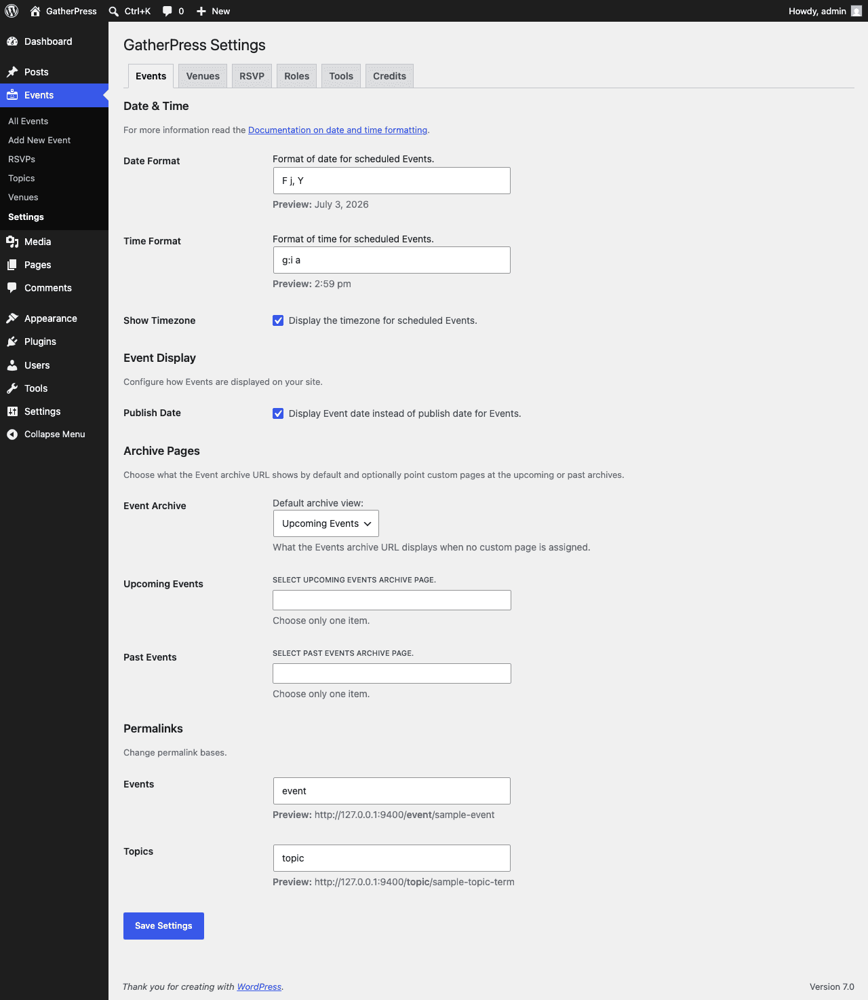
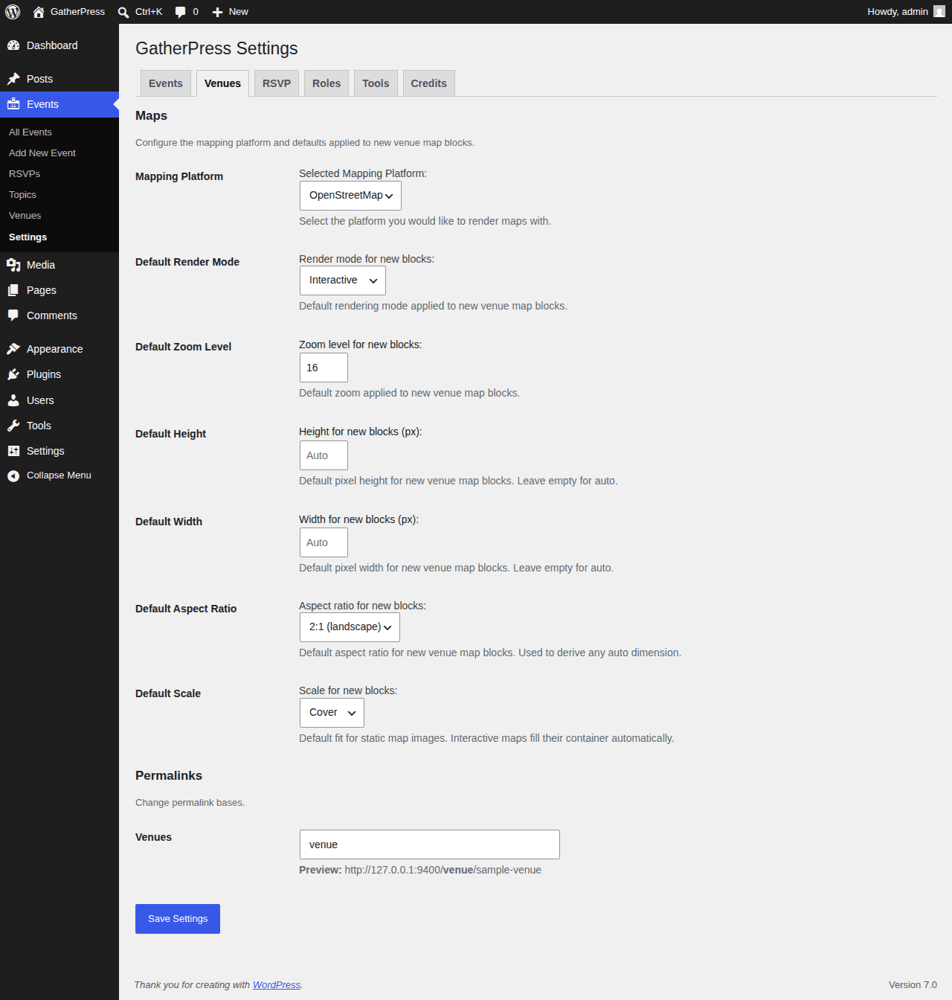
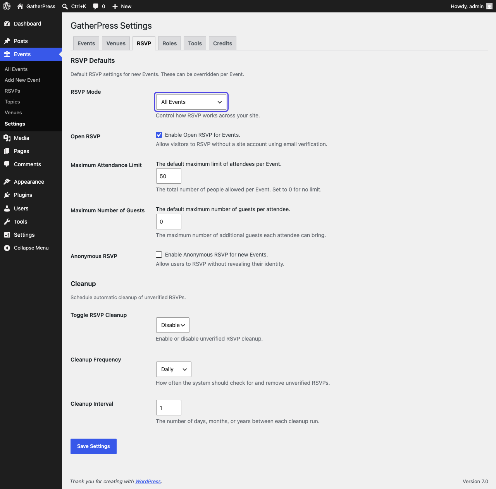

# Configuration

Once activated, GatherPress can be configured from your WordPress dashboard under **Events > Settings**.

The settings screen is organized into tabs: **Events**, **Venues**, **RSVP**, **Roles**, **Tools**, and **Credits**. Each tab has its own **Save Settings** button, so save before switching tabs.

> [!NOTE]
> GatherPress requires pretty permalinks. If your site uses Plain permalinks, event pages will not resolve, and **Tools > Site Health** shows a warning until a different permalink structure is selected under **Settings > Permalinks**.

## 🗓️ Events tab

### Date & Time

- **Date Format** and **Time Format** control how event dates and times are displayed, using [WordPress date and time format strings](https://wordpress.org/documentation/article/customize-date-and-time-format/). A live preview appears under each field.
- **Show Timezone** displays the timezone next to scheduled event times.

### Event Display

- **Publish Date** shows the event date instead of the publish date wherever WordPress would display a post date.

### Archive Pages

- **Event Archive** chooses what the events archive URL displays when no custom page is assigned: **Upcoming Events**, **Past Events**, or **None (return 404)**.
- **Upcoming Events** and **Past Events** optionally point the corresponding archive at a custom page you have created.

### Event and topic permalinks

- **Events** and **Topics** set the permalink bases used in event and topic URLs, with a live preview of the resulting URL.

## 📍 Venues tab

### Maps

These settings choose the mapping platform and the defaults applied to newly added venue map blocks. Changing a default does not alter maps already placed in your content.

- **Mapping Platform** selects **OpenStreetMap** (the default, no account needed) or **Google Maps**. Selecting Google Maps reveals a field for your Google Maps API key.
- **Default Render Mode** chooses between an interactive map and a static map image for new blocks.
- **Default Zoom Level**, **Default Height**, **Default Width**, **Default Aspect Ratio**, and **Default Scale** set the initial appearance of new venue map blocks. Height and width can be left empty for automatic sizing derived from the aspect ratio.

### Venue permalink

- **Venues** sets the permalink base used in venue URLs.

## ✅ RSVP tab

### RSVP Defaults

Default RSVP settings for new events; most can be overridden per event.

- **RSVP Mode** controls how RSVP works across your site (see [RSVP system](user/rsvp-system.md#rsvp-mode)):
    - **All Events**: RSVP is enabled for every event.
    - **Per event (default on)**: each event gets its own toggle in the editor; new events start with RSVP enabled.
    - **Per event (default off)**: each event gets its own toggle; new events start with RSVP disabled.
    - **Disabled**: RSVP is turned off sitewide, and the RSVP blocks and admin screens are hidden.
- **Open RSVP** allows visitors to RSVP without a site account, using email verification (see [Open RSVP](user/rsvp-system.md#open-rsvp-without-an-account)).
- **Maximum Attendance Limit** caps the total number of people per event. Set to 0 for no limit.
- **Maximum Number of Guests** sets how many additional guests each attendee may bring.
- **Anonymous RSVP** allows users to RSVP without revealing their identity.

### Cleanup

Unverified Open RSVPs can be removed automatically on a schedule.

- **Toggle RSVP Cleanup** enables or disables the automatic cleanup.
- **Cleanup Frequency** and **Cleanup Interval** control how often the cleanup runs.

## 👥 Roles tab

Assign users to GatherPress roles, such as **Organizer**. Organizers can manage events without needing broader site permissions.

## 🧰 Tools tab

Export your GatherPress settings to a file, or import settings from a previously exported file. Handy for copying a configuration between sites or keeping a backup before making changes.

## 💙 Credits tab

The people who contributed to the GatherPress release you are running.

## 🗓️ Creating an Event

Go to **Events > Add New**. The event editor uses WordPress blocks. You can add, remove, or rearrange blocks freely.

### Common Event Blocks

- **Event Date** – Set start/end dates, times, and timezone
- **Venue** – Select in-person or online; configure map options
- **RSVP** – Allow users to RSVP “yes” or “no”
- **RSVP Response** – Display attendees/non-attendees
- **Add to Calendar** – Let users export events to their calendar

## 📍 Creating a Venue

Go to **Events > Venues** and fill in:

- Full address, phone, website
- Map settings (type, zoom level, height)

## 🏷️ Creating Event Topics

Go to **Events > Topics** to add or manage topics (like categories for events). These help with filtering and discovery.
