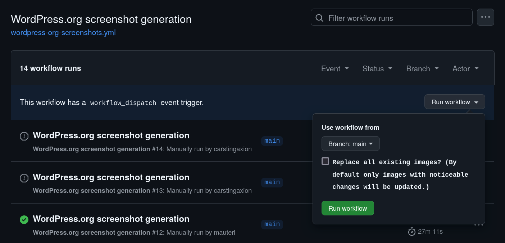
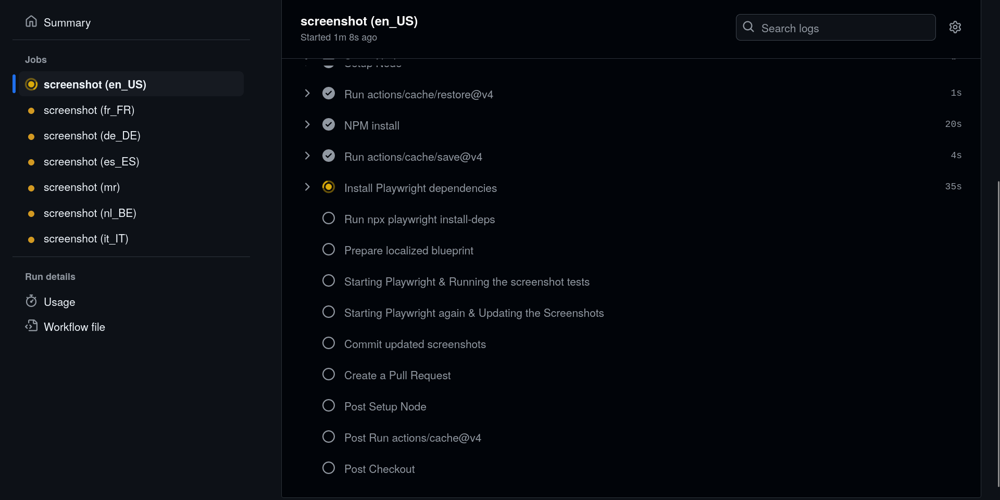
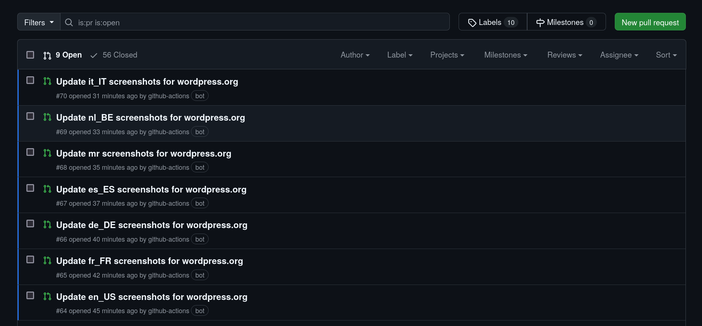

## Generate Screenshots using Playwright & Playground

> Generating screenshots in multiple languages for the plugin and keeping them up to date with the development might become a time intensive task.

GatherPress allows to generate screenshots for the plugin **automated & manually**, while sharing the same, [`wp-playground/cli`](https://github.com/WordPress/wordpress-playground/pull/1289) powered, setup. The started playground imports the [`GatherPress/demo-data`](https://github.com/GatherPress/demo-data) and sets some options, e.g. to hide GatherPress' admin-notices.

GatherPress uses Playwright for this task, which is a tool to do [end-to-end testing](../e2e-tests). Playwright has an advanced [screenshots API](https://playwright.dev/docs/screenshots), that allows to take screenshots for a full-page or an element only. Like for the e2e tests, it is configurable what browsers to use, what screenresolution to set, etc. Which screenshots to take is defined in a [wporg.spec.ts](../../../.github/scripts/wordpress-org-screenshots/wporg.spec.ts) file. The names of the generated files match the captions in the plugins [readme.md](../../../readme.md)!

With the help of WordPress Playground, identical instances are created one for each language, based on one identical [blueprint.json](../../../.github/scripts/wordpress-org-screenshots/blueprint.json) file. Screenshots are generated in all languages, with more than 90% of finished translations.

## Automated Screenshots

...are generated using a GitHub actions workflow.

While such a workflow could run on every major- and minor-, but not on bug-fix-releases, this is *currently **started manually** via `workflow_dispatch`*.

1. Start the workflow
   
   1. Just triggering this workflow will start the **default routine**, which checks for differences to prior versions of images and only updates the screenshots with noticaeable changes. Screenshots that did not exist before, will be created automatically.
   2. Or running the workflow with the "**Update all Screenshots?**" enabled, will skip the comparison and recreate all Screenshots.
2. After the workflow has successfully ran ...
   
3. ... **pull_requests are created**, one for each language, that could be reviewed by native speakers.
   

## Manually generating Screenshots

The workflow scripts can also be used to **manually create screenshots**. In general, only a Playground instance is needed. This could have different languages enabled or additional plugins added, that may extend GatherPress or demonstrate a new feature.

### Install dependencies

1. To generate screenshots you will have to install playwright using the following command:
   ```bash
   npx playwright install --with-deps
   ```

   > [!NOTE]
   > You also need to use Node.js 20 or later

2. Install the dependencies to create the Playground instance, using the following command:

   ```bash
   npm ci --legacy-peer-deps
   ```


### Start the Playground

A call to `npm run playground` will automatically setup a `wp-playground/cli` powered WordPress instance, already prepared to mount GatherPress from the current directory.

```bash
npm run playground -- --blueprint=./my/sample/addon/blueprint.json
```
Immediately the testing website will be reachable at `http://127.0.0.1:9400`, the user is `admin` and the password is `password`. 

### Run the Screenshot generator

Now while Playground is running in the background, it's possible to start the screenshot generator.

_Choose one of the following options_

1. For the _headless_ mode, use the following command:

   ```bash
   npm run screenshots:wporg
   ```

2. Run Playwright _visually_ (to run generating screenshots in isolation and change what's happening), use:

   ```bash
   npm run screenshots:wporg:ui
   ```


3. For _debug_ mode (which will open the browser along with Playwright Editor and allows you to record what's happening), use the following command:

   ```bash
   npm run screenshots:wporg:debug
   ```

   Run files that have *events.spec* in the file name.
   ```bash
   npm run screenshots:wporg:debug -- events.spec
   ```

   > [!NOTE]
   > When writing a screenshot-generator(-test), using the debug mode is recommended since it will allow you to see the browser and the test in action.

4. Run Tests independently _AND_ visually using the [Playwright VSCode extension](https://playwright.dev/docs/getting-started-vscode)

   Tell the VSCode extension what webserver to use, by adding the following to your `settings.json`:
   ```json
   "playwright.env": {
      "WP_BASE_URL":"http://127.0.0.1:9400"
   },
   ```

### Resources

#### Playwright & WordPress

- [Playwright Screenshots API](https://playwright.dev/docs/screenshots)
- [End-To-End Playwright test utils for WordPress](https://github.com/WordPress/gutenberg/blob/trunk/packages/e2e-test-utils-playwright/README.md)

#### Screenshots for WordPress Plugins

- [Screenshots | How Your Plugin Assets Work – Plugin Handbook | Developer.WordPress.org](https://developer.wordpress.org/plugins/wordpress-org/plugin-assets/#screenshots)

#### More about `wp-playground/cli`, as the environment

Examples with great documentation:

- [Playground CLI · WordPress/wordpress-playground#1289](https://github.com/WordPress/wordpress-playground/pull/1289)
- [PoC: Run E2E tests with WP Playground · WordPress/gutenberg#62692](https://github.com/WordPress/gutenberg/pull/62692)
- [Use WordPress Playground · swissspidy/wp-performance-action#173](https://github.com/swissspidy/wp-performance-action/pull/173)
