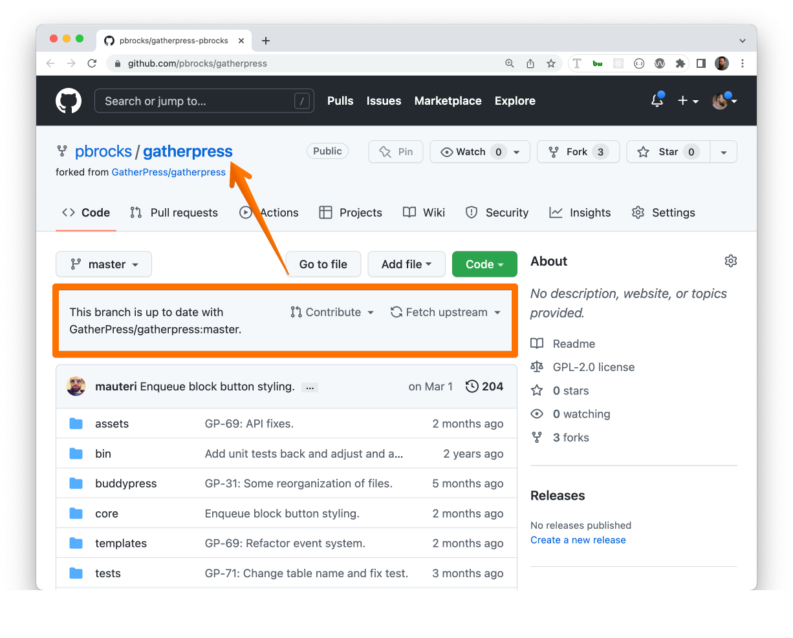
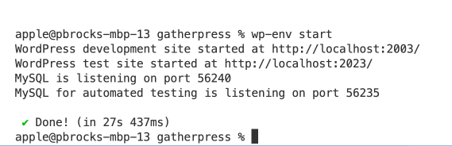
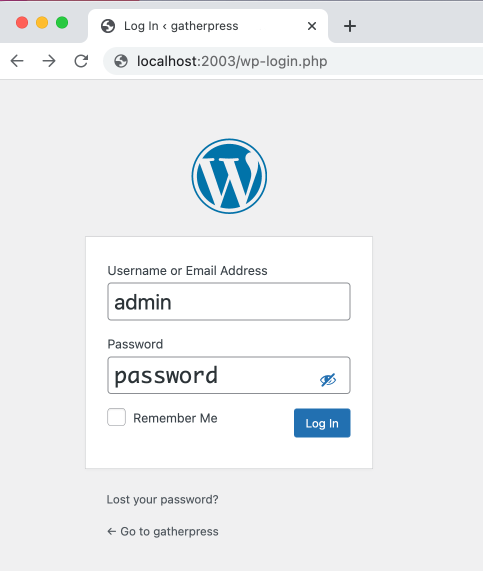
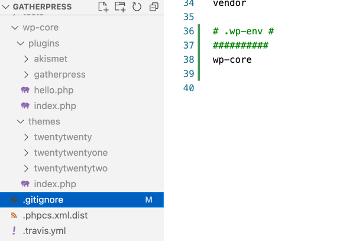

# Developer Documentation

## .wp-env

If you have Docker installed, you could use the `wp-env` package to load a WordPress development environment with this plugin automatically activated.

## Local Development

### Fork this repository

Although you can download a zip file of the plugin at:

```sh
https://github.com/GatherPress/gatherpress
```

If you want to help out with development, we suggest forking the code to your own GitHub repository and creating a branch from there.

### Clone this repository

Once you've forked the repo, you should now have a mirrored copy of GatherPress, but on your profile's URL, or something like this:

```sh
https://github.com/YourGitHubUsername/gatherpress
```

where `YourGitHubUsername` corresponds to your login name for GitHub.

To clone a local copy, open a terminal window and run the following command:

```sh
git clone git@github.com:YourGitHubUsername/gatherpress.git
```

if you have your SSH keys set up. If not, run:

```sh
git clone https://github.com/YourGitHubUsername/gatherpress.git
```

#### Note about customizing the URL

Once you have forked the GatherPress repo, you can also change the folder name of your version of the repository by going into your settings of your repo on GitHub's website.

```sh
https://github.com/pbrocks/gatherpress
```



## Install wp-env globally

In a terminal window, run:

```sh
npm i -g @wordpress/env
```

### Change directory and run wp-env

In your terminal window, run:

```sh
cd gatherpress
wp-env start
```

You should then see that a development site has been configured for you on localhost port 8889



### Log in to Site / Log into Site



### Development Site Plugins/Themes

To further customize the development site using your favorite or most familiar development plugins or themes, you are able to add whatever you like because of this code added to the `.wp-env.json` file:

```json
 "mappings": {
    "wp-content/plugins": "./wp-core/plugins",
    "wp-content/themes": "./wp-core/themes"
 },
 ```

In fact, after the initial setup, you may notice that in your code editor, there is now a `wp-core` folder containing the default plugins and themes, but it is grayed out, so the contents of this folder will not be committed to the GatherPress repository.



### Installing Dependencies

1. Install the version of Node in `.nvmrc.`. [NVM](https://github.com/nvm-sh/nvm) can be used to achieve this.
2. Install [Composer](https://getcomposer.org/doc/00-intro.md)
3. In your terminal window, `cd` to the `gatherpress` directory
4. Run `npm install` to get node dependencies
5. Run `npm run build` to compile scripts and styles
6. Run `composer install` to get PHPUnit dependencies

### To shut down your development session

Simply run:

```sh
wp-env stop
```

For more info on wp-env package, consult the [Block Handbook's page](https://developer.wordpress.org/block-editor/reference-guides/packages/packages-env/).
