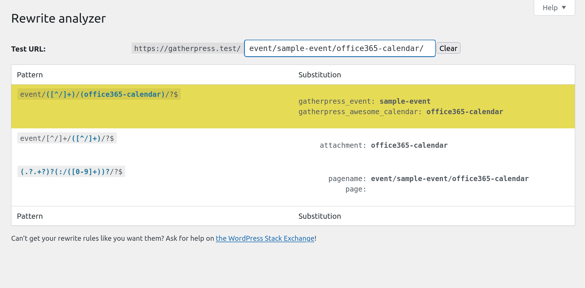

# Custom URL Endpoints

GatherPress provides some different and custom URL endpoints, for example `/ical` and `/feed/ical`.

**Existing custom endpoints:**

- `example.org/event/my-sample-event/ical`

   provides a downloadable .ics file in ical format.

- `example.org/event/my-sample-event/outlook`

   provides the same downloadable file as an alias.

- `example.org/event/my-sample-event/google-calendar`

   redirects to create a new event in *Google Calendar*.

- `example.org/event/my-sample-event/yahoo-calendar`

   redirects to create a new event in *Yahoo Calendar*.

- `example.org/event/feed/ical`

   provides a subscribable event feed in ical format with all events of the site.

- `example.org/venue/my-sample-venue/feed/ical`

   provides a subscribe-able event feed in ical format with all events at that venue.

- `example.org/topic/my-sample-topic/feed/ical`

   provides a subscribe-able event feed in ical format with all events grouped into that topic.

The most obvious functions to create such within WordPress seem to be [`add_feed()`](https://developer.wordpress.org/reference/functions/add_feed/) and [`add_rewrite_endpoint()`](https://developer.wordpress.org/reference/functions/add_rewrite_endpoint/) for this purpose.

Unfortunately both functions share a common pitfall, they are not restrictive to any post type at all. That would result in having a `/feed/ical` endpoint for all posts AND every other non-hierarchical, custom post type, which seemed to be the wrong way to go. A lot of code would have had to be written, to patch this behavior and remove those superfluous endpoints.

That's why GatherPress created its own Endpoint ~~API~~ helper and tries to fix the mentioned problems before they appear.

## GatherPress' own Endpoint API

In opposite to the former mentioned WordPress core functions GatherPress Endpoint API is flexible enough to not *only* provide endpoints for GatherPress. You can utilize its classes to create a plenty of different endpoints for your post types and taxonomies as well.

In general, one endpoint can be created ...

- for individual posts
- for post type archives
- for taxonomy archives

It can be either ...

- a redirect 

  *or*

- a template to load


### Setup new endpoints

To create a new endpoint you will want to create a new instance of the *pure* [`Endpoint()`](https://github.com/GatherPress/gatherpress/tree/main/includes/core/classes/endpoints/class-endpoint.php) class or one of its sub-classes:

- [`Posttype_Single_Endpoint()`](https://github.com/GatherPress/gatherpress/tree/main/includes/core/classes/endpoints/class-posttype-single-endpoint.php)

   for endpoints like `example.org/cpt/my-custom-post-type/new-endpoint`

- [`Posttype_Single_Feed_Endpoint()`](https://github.com/GatherPress/gatherpress/tree/main/includes/core/classes/endpoints/class-posttype-single-feed-endpoint.php)

   for endpoints like `example.org/cpt/my-custom-post-type/feed/new-endpoint`

- [`Posttype_Feed_Endpoint()`](https://github.com/GatherPress/gatherpress/tree/main/includes/core/classes/endpoints/class-posttype-feed-endpoint.php)

   for endpoints like `example.org/cpt/feed/new-endpoint`

- [`Taxonomy_Feed_Endpoint()`](https://github.com/GatherPress/gatherpress/tree/main/includes/core/classes/endpoints/class-taxonomy-feed-endpoint.php)

   for endpoints like `example.org/ctax/feed/new-endpoint`

These classes help to select *where* an endpoint should run.

To become properly callable as URL, the endpoints needs to know *what* to do when some URL is requested. Therefore each `Endpoint()` needs to have at least one of either:

- [`Endpoint_Redirect()`](https://github.com/GatherPress/gatherpress/tree/main/includes/core/classes/endpoints/class-endpoint-redirect.php)

  *or*

- [`Endpoint_Template()`](https://github.com/GatherPress/gatherpress/tree/main/includes/core/classes/endpoints/class-endpoint-template.php)

## Example 1 | Add events to *Office365 Calendar*

Example for a new redirection endpoint like `example.org/event/my-sample-event/office365-calendar`

- ### 1. Setup a new endpoint

	Let's create an endpoint to immediately add an event to a *Office365 Calendar*, similar to the existing for *Google* and *Yahoo*.

	

	To set up a new endpoint for single events, use the [`Posttype_Single_Endpoint()`](https://github.com/GatherPress/gatherpress/tree/main/includes/core/classes/endpoints/class-posttype-single-endpoint.php) class.

	```php
	use GatherPress\Core\Endpoints\Posttype_Single_Endpoint;
	use GatherPress\Core\Endpoints\Endpoint_Redirect;
	```

	```php
	new Posttype_Single_Endpoint(
		array(
			new Endpoint_Redirect(
				'office365-calendar',
				array( $this, 'get_office365_calendar_link' )
			),
		),
		'gatherpress_awesome_calendar',
	);
	```

	> [!TIP]
	> Run this on the `registered_post_type_{post_type}` action, to ensure that custom endpoints are registered after their post type is initialized. GatherPress will trigger php warnings if called too early or with unsupported arguments.

- ### 2. Define the callback for the endpoint

	```php
	use GatherPress\Core\Event;
	```

	```php

	/**
	 * Returns the office365 calendar URL for the current event.
	 *
	 * This method generates the appropriate URL for Office 365 Calendar.
	 * It uses the `Event` class to retrieve the necessary data for the event.
	 *
	 * @since 1.0.0
	 *
	 * @return string The URL to redirect the user to the appropriate calendar service.
	 */
	public function get_office365_calendar_link(): string {

		$event       = new Event( get_queried_object_id() );
		$date_start  = $event->get_formatted_datetime( 'Ymd', 'start', false );
		$time_start  = $event->get_formatted_datetime( 'His', 'start', false );
		$date_end    = $event->get_formatted_datetime( 'Ymd', 'end', false );
		$time_end    = $event->get_formatted_datetime( 'His', 'end', false );
		
		// Format the start and end datetime in the required format
		$startdt = sprintf('%sT%sZ', $date_start, $time_start);
		$enddt   = sprintf('%sT%sZ', $date_end, $time_end);
		
		$venue       = $event->get_venue_information();
		$location    = $venue['name'];
		$description = $event->get_calendar_description();

		if ( ! empty( $venue['full_address'] ) ) {
			$location .= sprintf( ', %s', $venue['full_address'] );
		}

		$params = array(
			'subject'   => sanitize_text_field( $event->event->post_title ),
			'body'      => sanitize_text_field( $description ),
			'startdt'   => $startdt,
			'enddt'     => $enddt,
			'location'  => sanitize_text_field( $location ),
			'path'      => '/calendar/action/compose',
			'rru'       => 'addevent',
		);

		return add_query_arg(
			rawurlencode_deep( $params ),
			'https://outlook.office.com/calendar/0/deeplink/compose'
		);
	}
	```

- ### 3. Use & retrieve the endpoint

	To use the newly created endpoints, you can use `Endpoints::get_url()` and rely on the used WordPress core functions internally:

	```php
	use GatherPress\Core\Endpoints;
	```

	```php
	Endpoints::get_url(
		'office365-calendar'
		get_queried_object_id(),
		'gatherpress_awesome_calendar',
	);
	```


## Resources

- Full, working code from all examples as part of **GatherPress Awesome**.

	Within [your GatherPress Awesome plugin](https://github.com/GatherPress/gatherpress-awesome), just enable it in `gatherpress-awesome/includes/classes/class-setup.php`

	```php
	// ENABLE or DISABLE
	// Test adding some awesome endpoints!
	// Awesome_Endpoints::get_instance(); // <-- Un-Comment to ENABLE
	```

	```php
	// ENABLED
	// Test adding some awesome endpoints!
	Awesome_Endpoints::get_instance(); // <-- :tada:
	```

### Testing & Validating

- [iCalendar Validator](https://icalendar.org/validator.html)
- [Monkeyman Rewrite Analyzer – WordPress plugin | WordPress.org](https://wordpress.org/plugins/monkeyman-rewrite-analyzer/)

### used & related from WordPress

- 

#### *explicitly not used*, but related from WordPress

- [`add_feed()`](https://developer.wordpress.org/reference/functions/add_feed/)
- [`add_rewrite_endpoint()`](https://developer.wordpress.org/reference/functions/add_rewrite_endpoint/)
