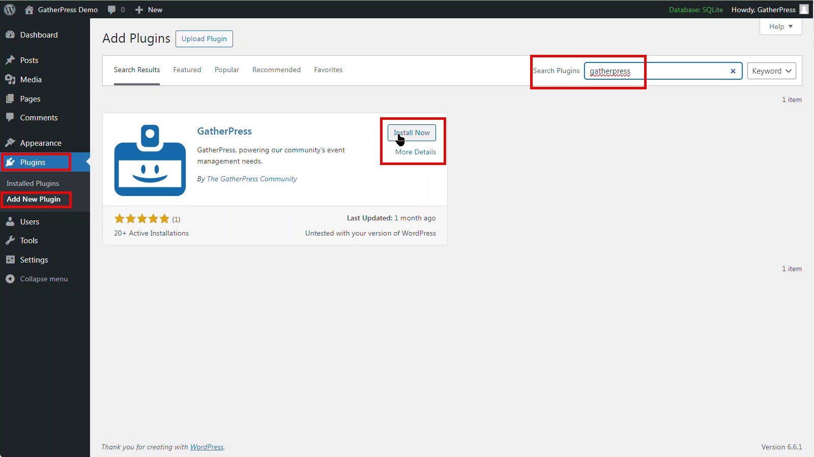

# 1. Install GatherPress

The easiest way to install GatherPress is by using the native Plugin Screen within WordPress.

To install, navigate to **Plugins** > **Add New Plugin** and then type into the search box **GatherPress**.

Once located, choose **Install** and then **Activate**

