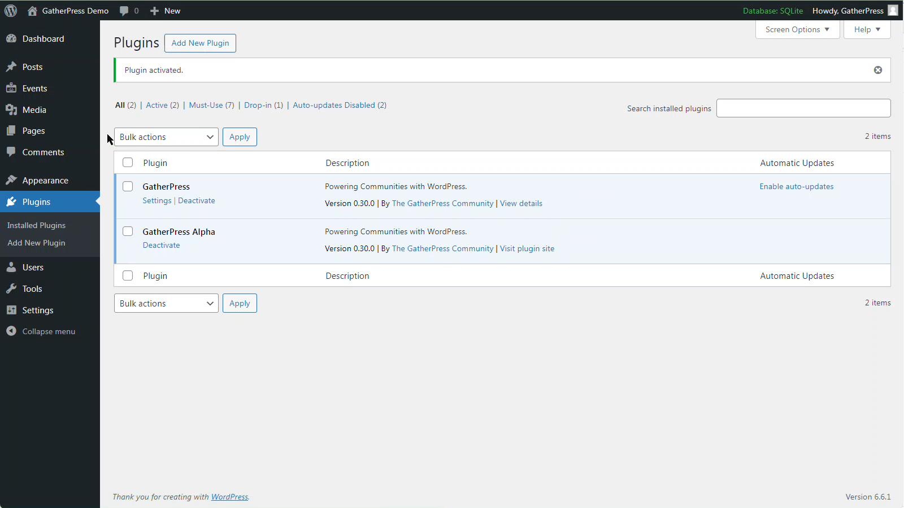
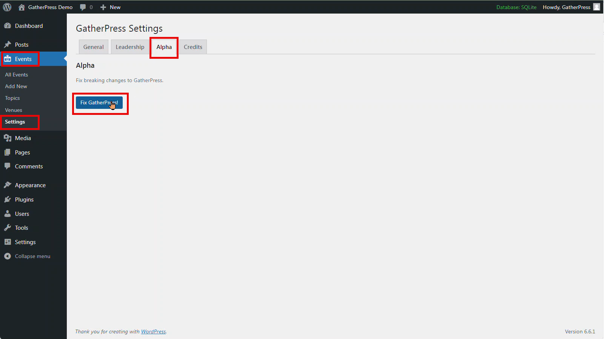

# 1a. GatherPress Alpha

## Why is GatherPress Alpha needed?

As we continue to refine and develop GatherPress, please use the GatherPress Alpha plugin alongside the core GatherPress plugin. The Alpha plugin helps manage breaking changes effectively.

## How to Determine Which Version to Install

1. **Check Your GatherPress Version**: Go to your website’s admin, navigate to the “Plugins” section, and locate GatherPress in the list of installed plugins. Note the version number currently installed.
2. **Find the Matching Release**: Visit the `Releases` section on this page (or the relevant repository) and locate the release that matches the version of GatherPress you have installed.
3. **Download the Plugin**: Under the `Assets` section of the matching release, find and click on `gatherpress-alpha.zip` to download it.
4. **Install the Plugin**: In your website’s admin, go to `Plugins` > `Add New Plugin` and upload the `gatherpress-alpha.zip` file you just downloaded.
5. **Repeat for Updates**: Follow these steps for each GatherPress update to ensure compatibility.
6. Activate the GatherPress Alpha plugin. Ensure the standard GatherPress plugin is also active. 
7. Navigate to the `Alpha` tab under `Events -> Settings` in the WordPress admin.
8. Click `Fix GatherPress!` to resolve any compatibility issues.






## Advanced Method

GatherPress Alpha also has a WP-CLI you can run to fix GatherPress. Simply run:

```
wp gatherpress alpha fix
```
