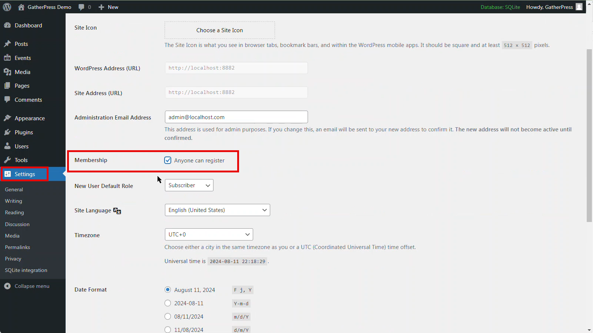
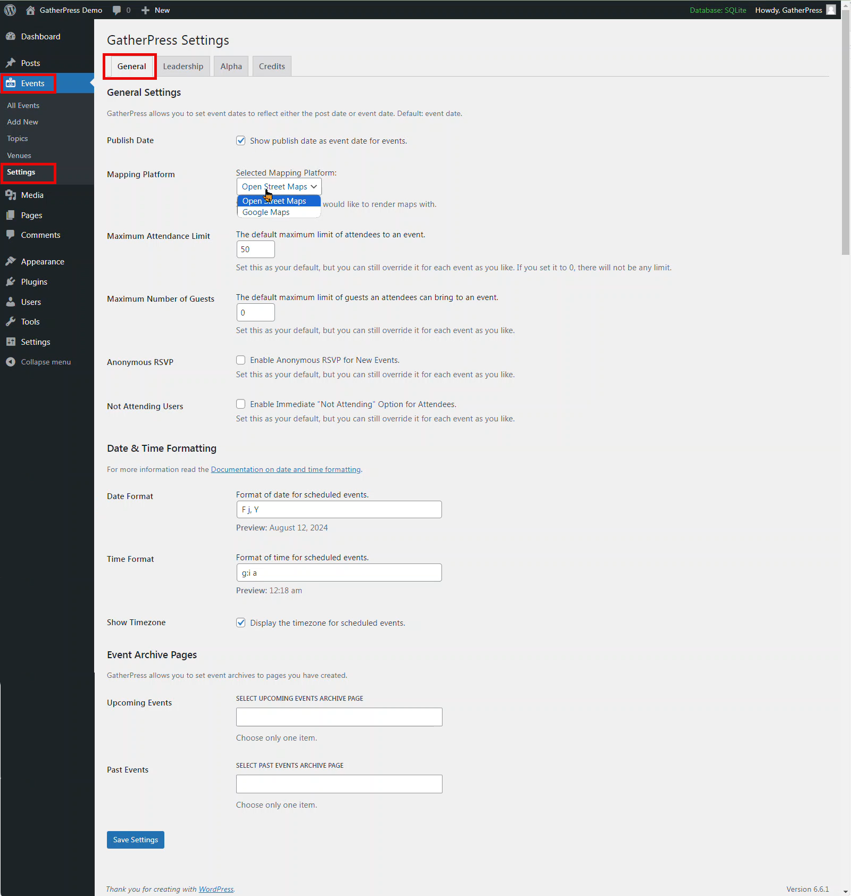
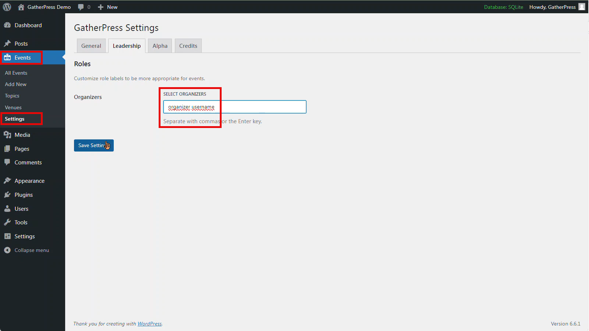

# 2. GatherPress settings

## Allow site registration

To provide visitors to your website the ability to RSVP to events, you'll need to allow site registration.

To allow users to register on your site, head to `Settings > General > Membership` and tick the box next to `Anyone can register`

If you run a multisite, this is done at the network admin level:
Settings > Network settings > Allow new registrations

## GatherPress settings

All settings for the GatherPress plugins are located in `Events > Settings > General`

**Publish Date**
As default, the event date is used as the date of the event you're adding to your website. You can toggle this change here to use the publish date instead.

**Mapping Platform**
You can select from two providers for Maps which are displayed on the event page. The default is `OpenStreetMap`, but it can be changed to `Google Maps` here.

**Maximum Attendance Limit**
This option allows you to choose the default number chosen as the maximum number of attendees you can have for an event. This is useful if you use the same venue which may have restrictions on occupancy. You can also amend this value on any event page. Choosing `0` will remove any limits.

**Maximum Number of Guests**
Similar to the previous option, this allows you to choose the default used for numbers of guests.

**Anonymous RSVP**
You can tick this box to allow attendees to provide an anonymous RSVP. It can be amended on each event page.

**Not Attending Users**
You can tick this box to allow the system to immediately choose 'No Attending' as their RSVP response when confirming attendance at an event. It can also be amended on each event page.

**Date and Time Formats**
Date and Time formats can be chosen here. These use the [standard PHP formatting characters](https://wordpress.org/documentation/article/customize-date-and-time-format/).

**Event Archive Pages**
You can choose a specific WordPress page to be used for the Upcoming Events and Events Archive pages here.

## Leadership

You can choose the organizers who arrange the events on the `Events > Settings > Leadership` section.

To choose an organizer, type their username into the relevant box, and follow with a comma `,` to add multiple people.

