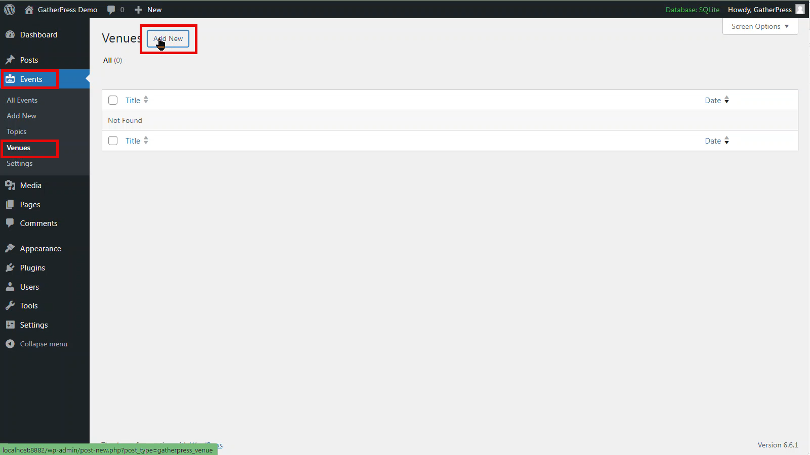
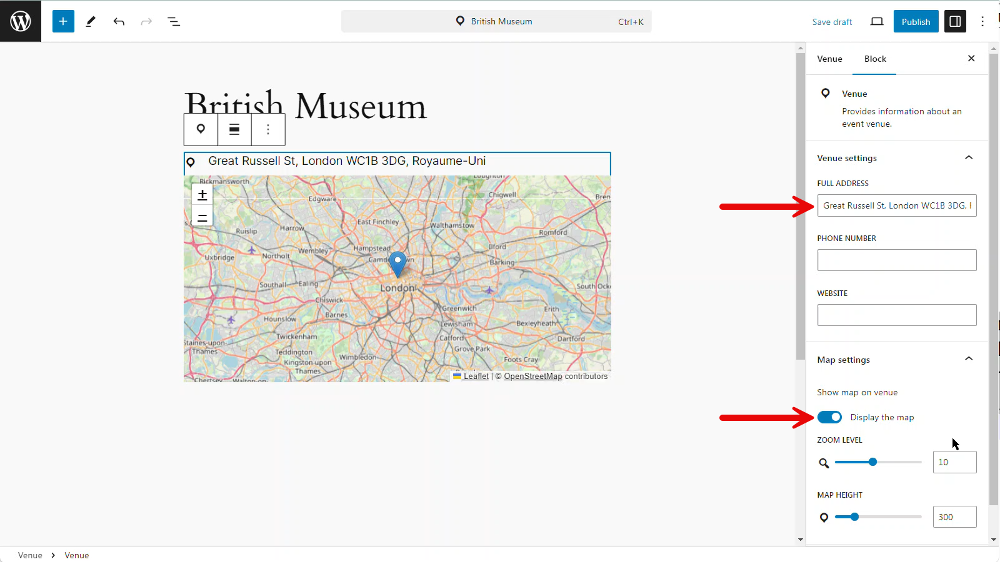
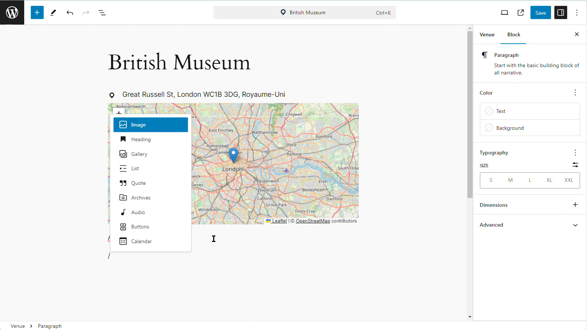

# 3. Create a venue

Go create a venue, head to `Events > Venues > Add New`

The venue pages are similar to standard WordPress pages and use the familiar editor screen. The title of the page is used as the venue name.

You can provide relevant venue information in the sidebar. Here, you'll be able to provide relevant information about the venue such as the street address, phone number and website.
The map will show automatically show in the body of the page. You can choose to display the map or not, as well as its zoom level and height using the `display the map` toggle button.

You can also add standard blocks to the page to customize the venue page as you'd like.

