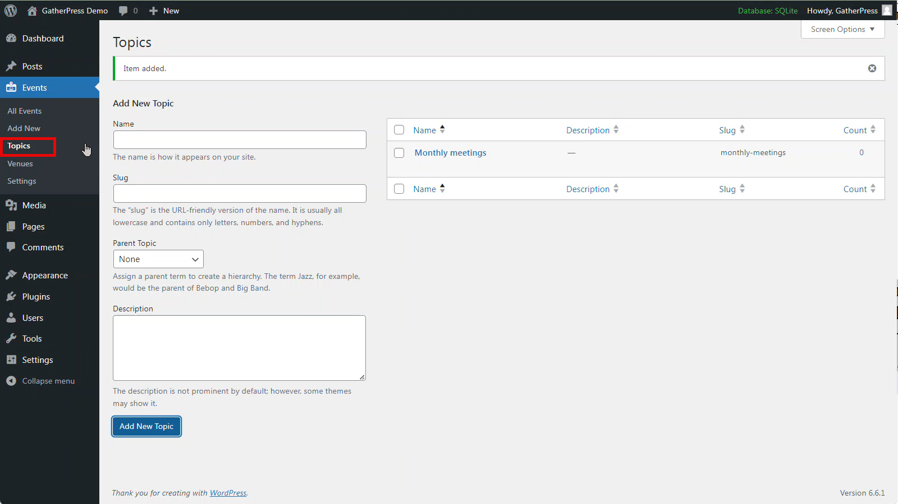

# 4. GatherPress topics

Topics are used by GatherPress to categorize your events as a standard taxonomy feature. 

You can create topics under `Events > Topics` and these can then be selected for your events.

