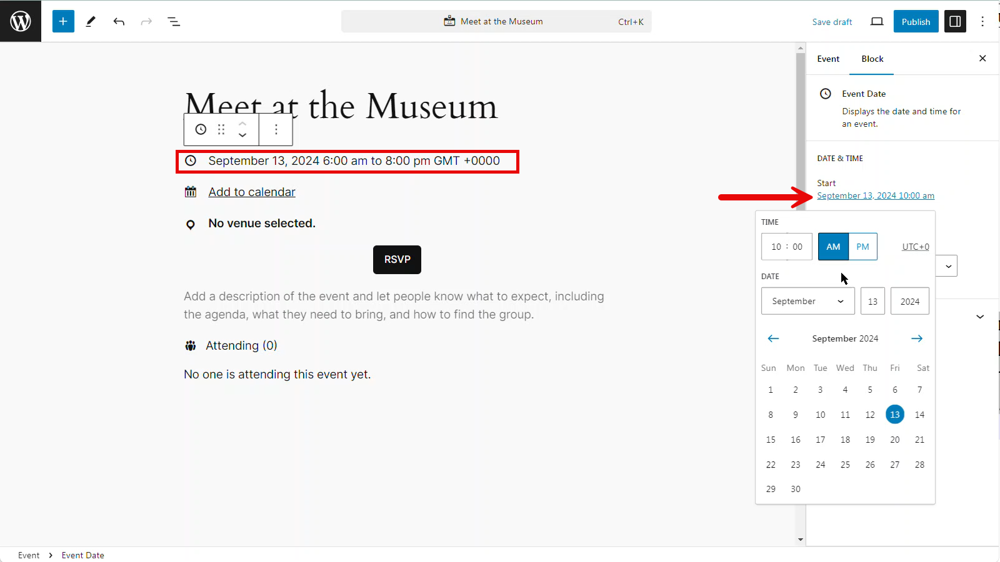
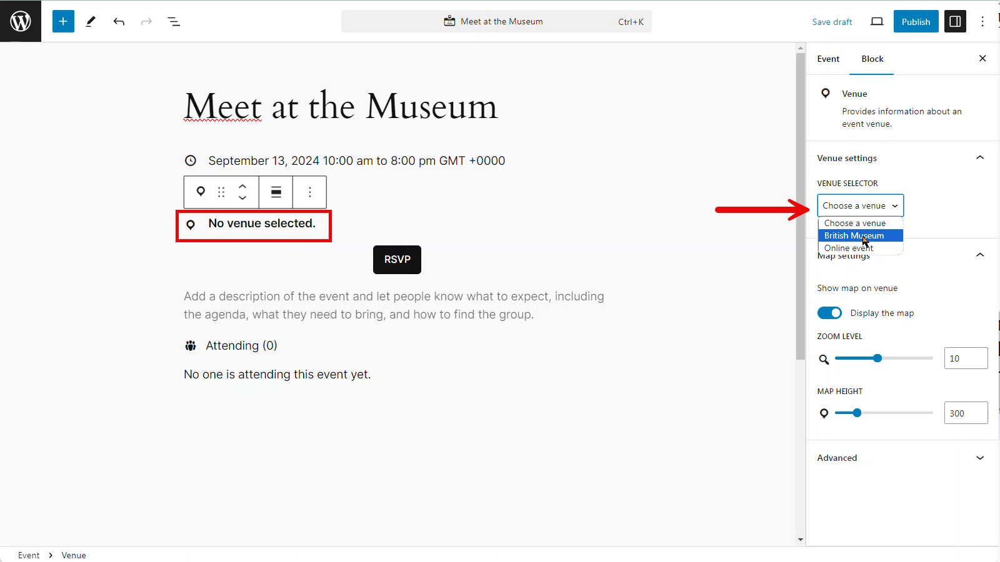
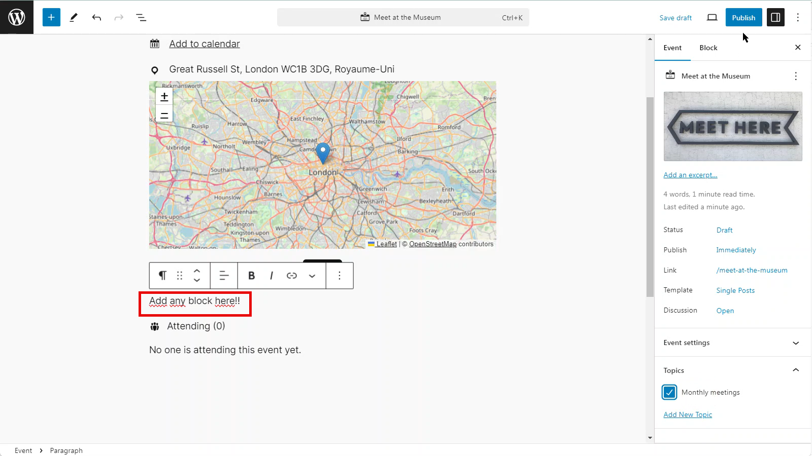

# 5. Create or edit an event

To create an event, head to `Events > Add new` (or Events > All events > Add new (button))

Once in the editor, add a title - this will be used as the name of your event.

A range of options are then available through the sidebar.

## Date and time

To set the date and time, click on the relevant block and change the date and time on the right sidebar.
The default time zone, date format and time format are defined in the [2. GatherPress settings](./2-gatherpress-settings.md)

## Venue, online or hybrid

If you created venue(s) (see [3. Create or edit a venue](./3-create-or-edit-a-venue.md)), you'll be able to select it in the dropdown. 

If your event is online, select the `Online event` option in the drop down and then a box will appear to add your online meeting link.

To have an hybrid event, with both a venue and an online link, you'll need to add a second time the Venue block.

You can also add any block in the body to customize your event page.

## Additional Features

On the right sidebar under `event`, you can also add a featured image, change general post settings, and also select your event topic.
