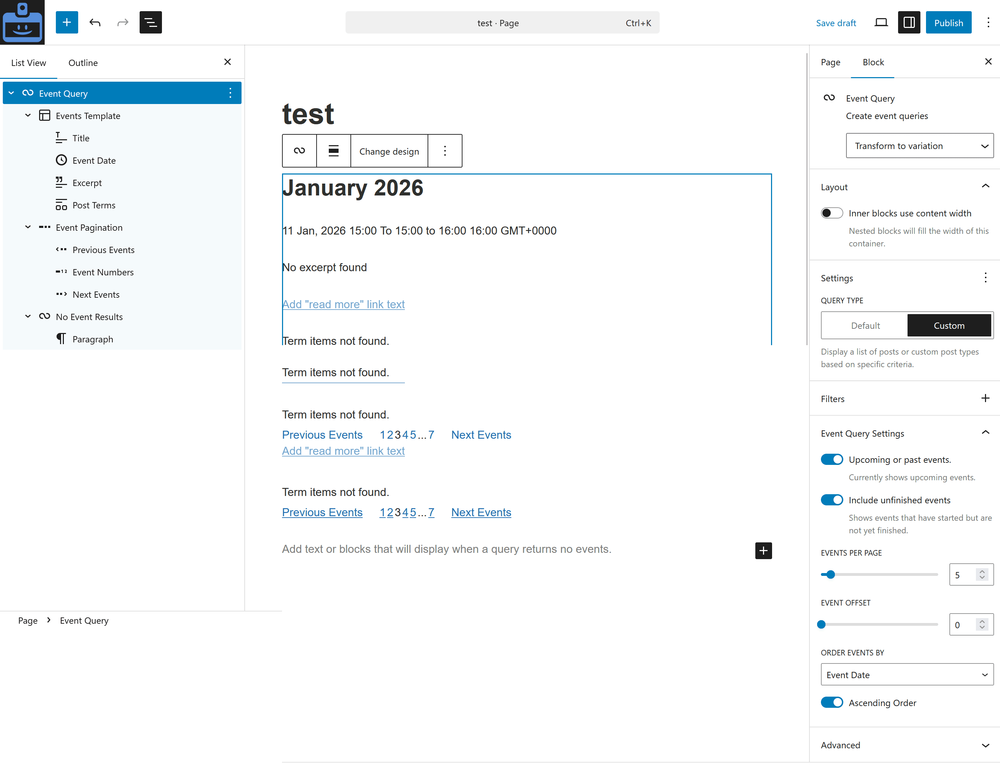

# Event Query block

GatherPress includes a block-variation of the `core/query` block, called _Event Query_. This block allows for everything a normal query block can do including the following:

1. Allows endless customization in terms of layout & style, incl. the use of interactive blocks.
2. Allows editors to drop in the **Event Card with RSVP** starter pattern (featured image, date, title, venue, online event link, RSVP responses, and RSVP button) via the block's **Choose** button or the **Replace** button in the top toolbar.
3. Allows editors to start with a minimal event scaffold via the **Start blank** button and the underlying [Block Variation Picker](https://github.com/WordPress/gutenberg/tree/trunk/packages/block-editor/src/components/block-variation-picker) — whichever scaffold the editor picks, the post template is seeded with `Event Date` + a linked post title rather than WordPress's generic post-date layout.
4. Allows to query either **past or upcoming events**.
5. Allows to select for the inclusion or exclusion of **started, but not yet finished, events**.
6. If used within a `gatherpress_event` post, an editor can choose to **"Exclude** (the) **current Event"**
7. Allows for **custom ordering** (`ORDER BY`) of the events by:
   - datetime (default)
   - random
   - title
   - post_id
   - last modified date
8. ... in either ASC or DESC `ORDER`
9. Allows to filter the queried events by Author, Keyword, Topic or Venue (and any other additionally registered taxonomies).
10. **Filter by current venue** toggle — when placed on a venue page, the query is automatically scoped to that venue's events. The toggle is hidden on regular posts where there's no venue context to use. In templates or template parts, the toggle is shown with a note that the filter only takes effect when the template renders on a venue page.
11. The variation is automatically loaded, when an editor chooses the „Event“ post type in a regular `core/query` block.
