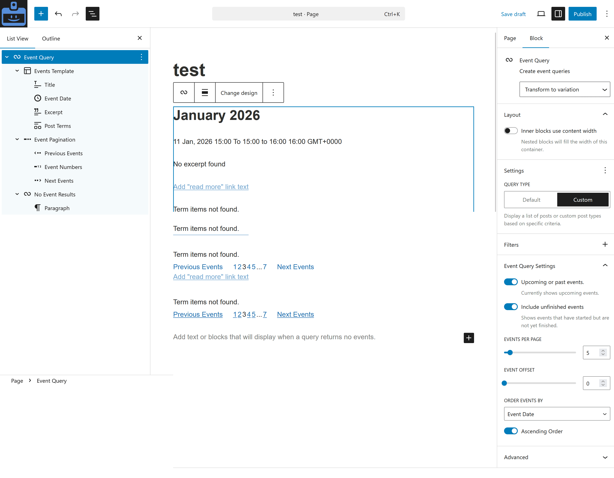

# Event Query block

GatherPress includes a block-variation of the `core/query` block, called _Event Query_. This block allows for everything a normal query block can do including the following:

1. Allows endless customization in terms of layout & style, incl. the use of interactive blocks.
2. Allows editors to drop in the **Event Card with RSVP** starter pattern (featured image, date, title, venue, online event link, RSVP responses, and RSVP button) via the block's **Choose** button or the **Replace** button in the top toolbar.
3. Allows editors to start with a minimal event scaffold via the **Start blank** button and the underlying [Block Variation Picker](https://github.com/WordPress/gutenberg/tree/trunk/packages/block-editor/src/components/block-variation-picker) — whichever scaffold the editor picks, the post template is seeded with `Event Date` + a linked post title rather than WordPress's generic post-date layout.
4. Allows to query either **past or upcoming events**.
5. Allows to select for the inclusion or exclusion of **started, but not yet finished, events**.
6. If used within a `gatherpress_event` post, an editor can choose to **"Exclude** (the) **current Event"**
7. Allows for **custom ordering** (`ORDER BY`) of the events by:
   - datetime (default)
   - random
   - title
   - post_id
   - last modified date
8. ... in either ASC or DESC `ORDER`
9. Allows to filter the queried events by Author, Keyword, Topic or Venue (and any other additionally registered taxonomies).
10. **Filter by current venue** toggle — when placed on a venue page, the query is automatically scoped to that venue's events. The toggle is hidden on regular posts where there's no venue context to use. In templates or template parts, the toggle is shown with a note that the filter only takes effect when the template renders on a venue page.
11. The variation is automatically loaded, when an editor chooses the „Event“ post type in a regular `core/query` block.

## Curated and mixed event lists with Advanced Query Loop

[Advanced Query Loop](https://wordpress.org/plugins/advanced-query-loop/) (AQL)
adds generic query controls to the WordPress Query Loop block. GatherPress
adds event-specific controls when an AQL query targets Events.

Use AQL when you need to hand-pick events or combine events with other post
types. Use the GatherPress Event Query variation when you only need the usual
upcoming or past event lists.

### Create a curated list of events

Use this approach for a list such as featured events for a quarter.

1. Install and activate Advanced Query Loop.
2. Add an **Advanced Query Loop** block to the page or template.
3. In AQL's query settings, set the post type to **Events**.
4. In the **Event Query Settings** panel added by GatherPress, choose whether
   the list contains upcoming or past events, configure inclusion of unfinished
   events, and choose event ordering.
5. In AQL's **Include Posts** control, search for and select the individual
   events to display.
6. Design the loop template as usual, for example with a title, Event Date,
   and RSVP blocks.

The **Include Posts** control belongs to AQL. It can find events by title or
ID and can be paired with AQL's exclude control when needed.

#### Why start with the AQL block

GatherPress event query settings and AQL's generic controls appear together
only on the AQL variation. Start with **Advanced Query Loop**, rather than the
GatherPress Event Query variation, when you need to include selected events.

### Mix events with posts in one list

AQL can display Events together with posts or other post types.

1. Add an **Advanced Query Loop** block.
2. Set the primary post type in the AQL query settings.
3. Use AQL's **Additional Post Types** control to add Events and any other
   desired post types.
4. Design a template that makes sense for every type included in the list.

This creates one normal WordPress query containing the selected post types.
It is useful for a chronological content feed where events and posts can
appear together.

#### Limits of mixed lists

Mixed lists have two important limitations:

- **There is one ordering rule.** Events normally order by their event date,
  while posts normally order by publish date. A single query cannot use event
  date for events and publish date for posts in one interleaved list. Choose
  one ordering method for the complete list.
- **Event Query Settings are unavailable.** Once a non-event post type is in
  the query, GatherPress does not show the event-specific panel. Upcoming and
  past filters do not apply to regular posts, so the mixed list is a plain
  chronological list rather than an event-date query.

If you need separate event-date ordering and post-date ordering, use separate
Query Loop blocks instead of a mixed list.
