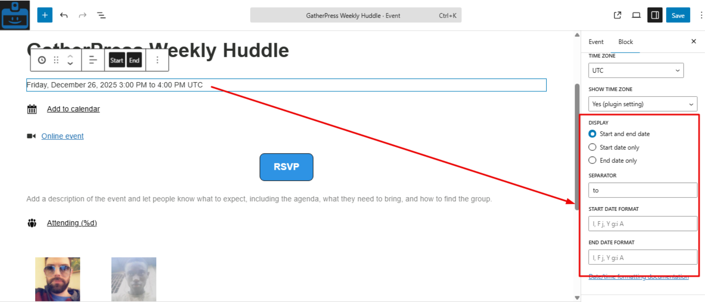
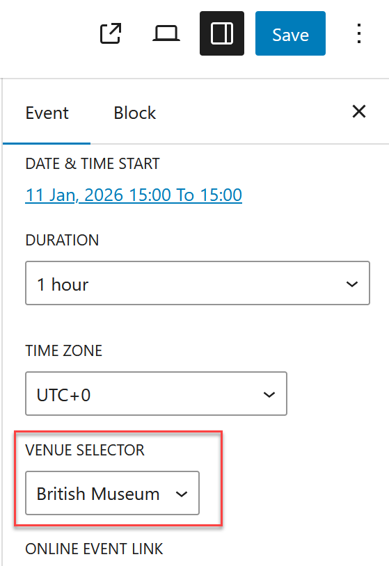
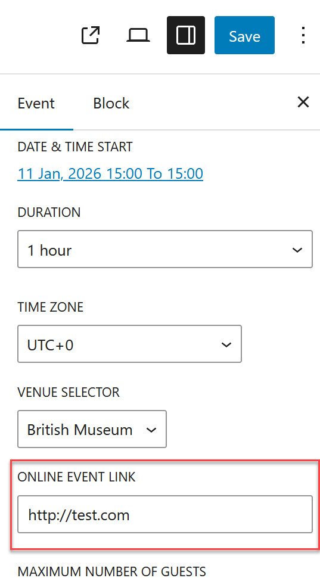
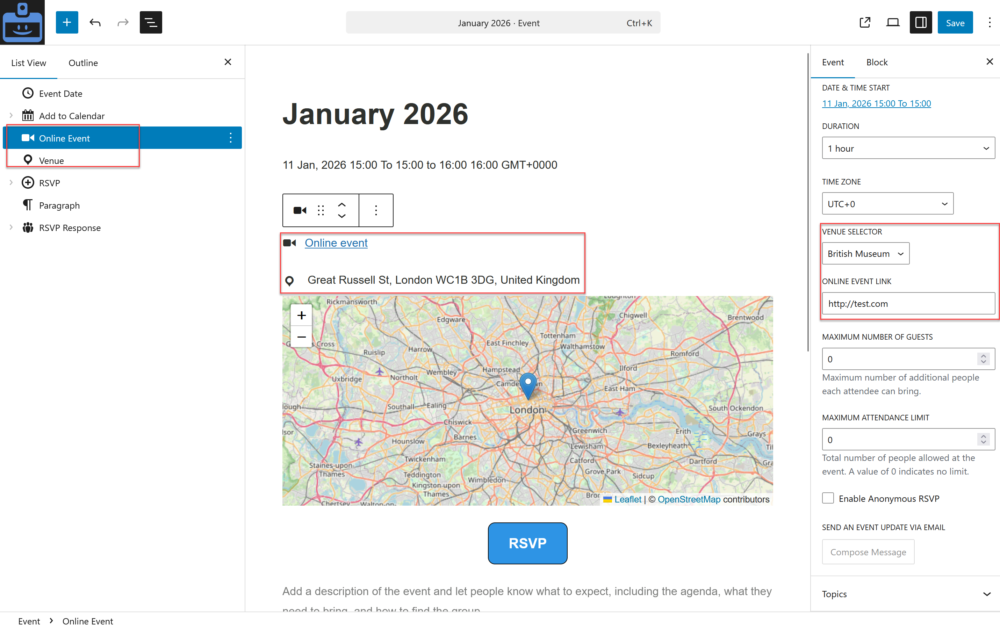

# Creating and managing events

This section explains how to create, edit, and maintain events in GatherPress, using the concepts introduced earlier.

## Creating an event

To create an event:
1. Go to `Events > Add New` in the WordPress admin.  
2. Enter a title for your event.  
3. Add your event description using blocks, just like a regular page or post.  
4. Configure the event-specific settings (date, time, venue, RSVPs, etc).

Event creation combines:

* Event settings panels: structured event data for the event and event blocks
* Main editor area: content blocks (description, agenda, speakers, images)  

## Required event information

An event must have:

* A title  
* A date and time, by default it’s set on the following day at 6:00pm

Everything else is optional and can be added later, including the venue.

## Setting date and time

In the event settings:

* Add a start date and time.  
* Add a duration or an end date and time.  
* It is possible to end the event on another day, but recurring event functionality will be added in a future version.

Behavior to be aware of:

* Date and time are independent from the publish date.  
* Display follows the date and time format defined in settings by default and can be adjusted at the Event Date block level.  
* Timezones follow the user profile or site timezone.

## Assigning a venue

You can assign a venue to an event by choosing an existing venue in the Venue Selector dropdown, or leave it empty.

## Online event

Online events must be defined by adding a link to the event settings.

## Hybrid event

For events happening both at a physical location and online, you must add the venue in the dropdown field, it will use the Venue Block to display the address and map, then add the Online Event block and fill both information in the settings panel.

## Configuring RSVPs

In the event settings panel, below the time and venue options, you will find:

* Maximum number of guests  
* Maximum attendance limit
* Enable Anonymous RSVP

Defaults come from GatherPress settings, but all of these can be overridden for each event.

[More on the RSVP system](./rsvp-system.md)

## Publishing and updating events

When publishing or updating an event:

* Changes to content blocks affect layout and text only.  
* Changes to date, time, or venue may affect how the event is listed or displayed.  
* Existing RSVPs are preserved when editing events.
* A Compose message prompt appears at the top of the event to invite you to inform users, see [more on Emails](./emails.md)

