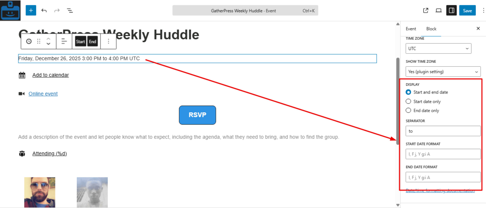
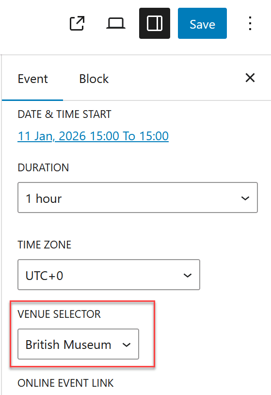
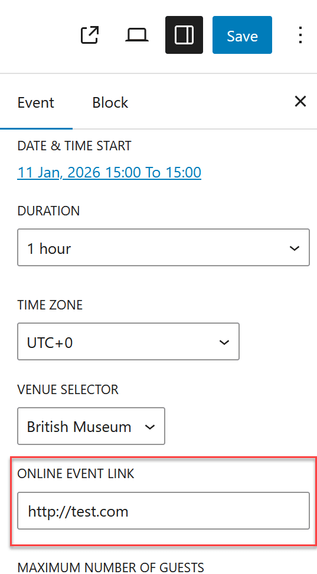
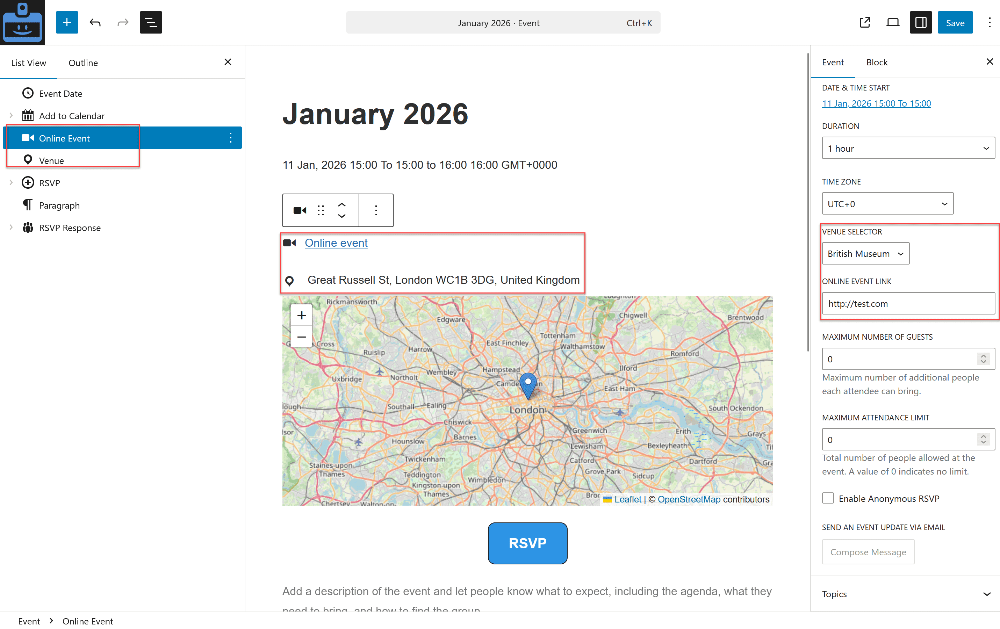

# Creating and managing events

This section explains how to create, edit, and maintain events in GatherPress, using the concepts introduced earlier.

## Creating an event

To create an event:

1. Go to `Events > Add New` in the WordPress admin.  
2. Enter a title for your event.  
3. Add your event description using blocks, just like a regular page or post.  
4. Configure the event-specific settings (date, time, venue, RSVPs, etc).

Event creation combines:

* Event settings panels: structured event data for the event and event blocks
* Main editor area: content blocks (description, agenda, speakers, images)  

## Required event information

An event must have:

* A title  
* A date and time, by default it’s set on the following day at 6:00pm

Everything else is optional and can be added later, including the venue.

## Setting date and time

In the event settings:

* Add a start date and time.  
* Add a duration or an end date and time.  
* Turn on All day for an event that runs the whole day rather than at a set time.  
* It is possible to end the event on another day, but recurring event functionality will be added in a future version.

Behavior to be aware of:

* Date and time are independent from the publish date.  
* Display follows the date and time format defined in settings by default and can be adjusted at the Event Date block level.  
* Timezones follow the user profile or site timezone.

For developers: the Duration control's preset options and default value can be customized with JavaScript filters. See [Event duration filters](../developer/event-duration.md).

### All day events

All day makes an event cover whole days instead of a span of hours. Turning it on:

* Turns the start and end pickers into date pickers, and replaces the Duration control with an end date.
* Stores the event as running from the start of the first day to the end of the last one, so it still sorts and filters alongside every other event.
* Shows the date without a time, using the date format from settings. A format saved on the Event Date block keeps its date and loses its time: wanting a time means the event is not all day.

Leave the end date on the same day for a one-day event, or set a later one to span several days.

An all day date does not move between timezones. An event on the 29th reads as the 29th to every visitor, wherever they are and whatever the site timezone is.

Turning All day back off restores the times the event had before, on whichever dates are selected by then, so flipping the toggle to look at it does not cost you what you had. Those times are only remembered while the editor stays open. Reopen an event that was saved as all day and there are no earlier times left to come back to, so it returns as running from the start of the day to the end of it.

### Appending the time zone

Append time zone decides whether the event's timezone is printed after the date:

* Always prints it, overruling the Event Date block.
* Never leaves it off, overruling the Event Date block.
* Default gives the event no say, so the block decides, falling back to the site setting when the block does not say either.

The setting lives on the event rather than the block, so Always and Never still apply where the event date comes from a site template and there is no Event Date block in the post to configure.

Turning on All day moves the setting from Default to Never, since a bare date has no time for a timezone to qualify. Turning it back off returns it to Default. Always is left alone in both directions.

## Assigning a venue

You can assign a venue to an event by choosing an existing venue in the Venue Selector dropdown, or leave it empty.

## Online event

Online events must be defined by adding a link to the event settings.

## Hybrid event

For events happening both at a physical location and online, you must add the venue in the dropdown field, it will use the Venue Block to display the address and map, then add the Online Event block and fill both information in the settings panel.

## Configuring RSVPs

In the event settings panel, below the time and venue options, you will find:

* Enable RSVP — only shown when the sitewide [RSVP Mode](./rsvp-system.md#rsvp-mode) is set to one of the per-event modes; turns RSVP on or off for this event
* Enable Open RSVP — lets visitors without an account RSVP to this event, see [Open RSVP](./rsvp-system.md#open-rsvp-without-an-account)
* Maximum number of guests  
* Maximum attendance limit
* Enable Anonymous RSVP

Defaults come from GatherPress settings, but all of these can be overridden for each event.

[More on the RSVP system](./rsvp-system.md)

## Publishing and updating events

When publishing or updating an event:

* Changes to content blocks affect layout and text only.  
* Changes to date, time, or venue may affect how the event is listed or displayed.  
* Existing RSVPs are preserved when editing events.
* A Compose message prompt appears at the top of the event to invite you to inform users, see [more on Emails](./emails.md)

Published events automatically appear in the site's subscribable [calendar feeds](./calendar-feeds.md), so attendees following a venue, topic, or the whole site see new and updated events in their own calendar apps.

