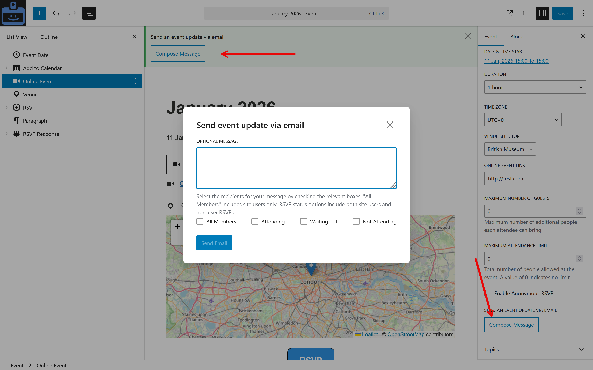

# Emails

GatherPress includes an emailing system for event communication.

Emails are sent using WordPress’ mail system (so delivery depends on your hosting and/or an SMTP plugin).

It covers different needs:

* Organizer emails to participants
    * From the event admin UI, organizers can compose a message and email specific groups linked to the event.
    * Typical recipient groups include:
        * All Members: it will email every user of the website (unless they opt-out in their profile for such messages)
        * Attendees (people who RSVPed “yes”)
        * Non-attendees (people who RSVPed “no”)
        * Waiting list (when an event has a limit)
* RSVP confirmation without an account (email handshake)
  See more under the [RSVP system](./rsvp-system.md) section.

