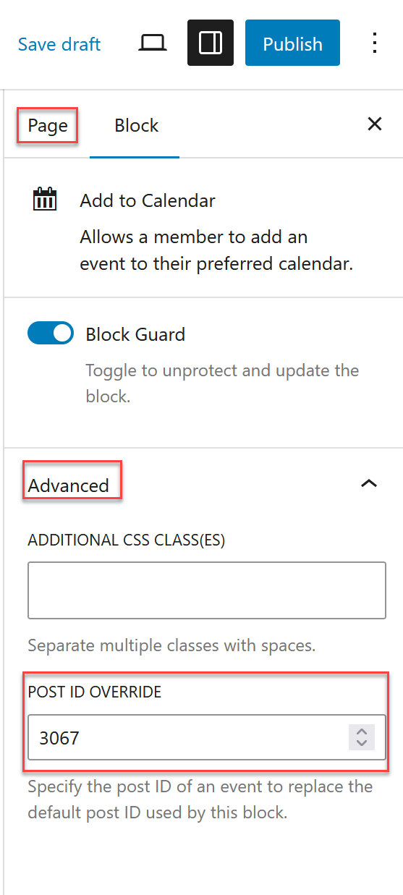

# Displaying event-related information elsewhere (ID Override)

The following GatherPress blocks support an Event ID Override.

- Event Date
- Add to Calendar
- RSVP
- RSVP Form
- RSVP Response

What this allows:

- By default, event blocks use the current event context.  ID Override will display RSVP-related information outside of the event page.  
- Place RSVP, attendance status, or related UI elements on other pages or posts.

This is found when selecting a block that supports it, clicking "Advanced" and adding a valid event post ID to "Post ID Override". When an Event ID is provided, the block explicitly targets that event instead.

Typical use cases:

- Showing RSVP or attendance information on a custom landing page.  
- Reusing RSVP UI in a modal or sidebar outside the single event layout.

Notes:

- The Event ID must correspond to an existing event.  
- Using an override does not duplicate data; it only changes which event the block references.  
- Event ID overrides work on regular content (pages, posts, custom layouts).  
- Event ID overrides cannot be set or overridden in templates; templates rely on the current event context.
