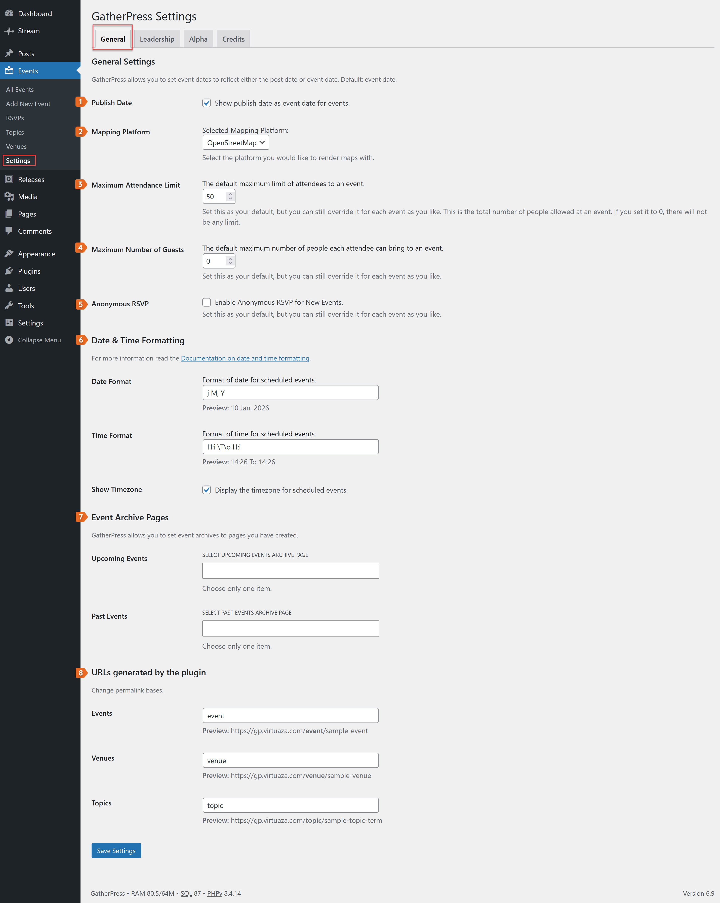
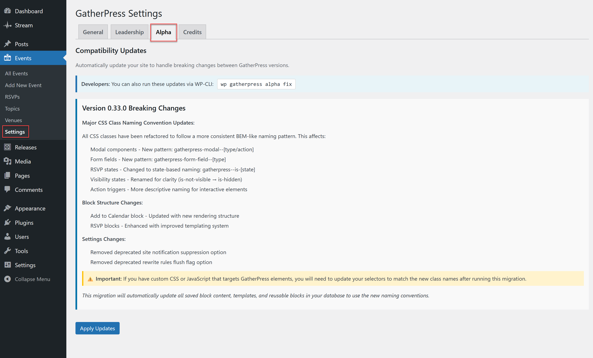

# Getting started

This section helps you configure GatherPress for the first time and understand which settings apply globally and which can be overridden per event.

## Installation

* Install GatherPress from the WordPress plugin directory.  
* Activate it.  
* After activation, a new Events menu appears in the WordPress admin.

Find more ways to install on the [Installation Guide](../installation.md)

## GatherPress settings

GatherPress settings apply globally and define defaults. Most of them can be overridden at the event level.

You can find these settings under: `GatherPress > Settings`



### 1. Publish date as event date

Option: Show publish date as event date for events

* Important: this currently only works on classic themes  
* When enabled, the event date defaults to the post publish date.  
* When disabled (default), the event date is independent from the publish date.

### 2. Mapping platform

Option: Selected Mapping Platform

* Defines which mapping service is used to render maps for physical venues.  
* Current default: OpenStreetMap.

Override per event: No (this is a global display choice).

### 3. Maximum attendance limit

Option: Maximum Attendance Limit

* Sets the default maximum number of attendees for new events.  
* This is the total number of people allowed at an event.  
* A value of `0` means no limit.

Override per event: Yes.

### 4. Maximum number of guests

Option: Maximum Number of Guests

* Defines how many additional guests each attendee may bring.  
* This applies as a default for new events.

Override per event: Yes.

### 5. Anonymous RSVP

Option: Enable Anonymous RSVP for New Events

Important clarification:

In GatherPress, “anonymous” does not mean unknown to event organizers.

What “anonymous” means here:

* The attendee is listed without a name or photo on the front end.  
* Other visitors can see that someone RSVP’d, but not who they are.

What “anonymous” does not mean:

* The attendee is not anonymous to event organizers.  
* Organizers can still see the attendee’s email address and RSVP status in the admin.

This setting controls visibility, not identity.

Relationship with accounts:

* Anonymous RSVP can be used with or without a WordPress account.  
* It must not be confused with RSVP without an account, which controls authentication, not visibility.

Override per event: Yes.

### 6. Date and Time Formatting

These settings control how dates and times are displayed

* Defines the format used for event dates.  
* Uses standard WordPress / PHP date formatting.  
* A preview is shown in the settings screen.

Override per event: Yes.

#### Timezone display

Option: Display the timezone for scheduled events

* When enabled, the timezone is shown on the front end.  
* The timezone follows:  
  1. The user timezone set in their profile (if logged-in)  
  2. Otherwise, the site timezone

Override per event: Yes.

### 7. Event Archive Pages

GatherPress allows you to assign pages as event archives.

* Upcoming Events page
* Past Events page

### 8. URLs generated by GatherPress

These settings define the URL structure for GatherPress content.

* Event URL, defaults to `event`
* Venue URL, defaults to `venue`
* Topic URL, defaults to `topic`

## Alpha

### Why is GatherPress Alpha needed?

As we continue to refine and develop GatherPress, please use the GatherPress Alpha plugin alongside the core GatherPress plugin. The Alpha plugin helps manage breaking changes effectively.

### How to Determine Which Version to Install

1. Check Your GatherPress Version: Go to your website’s admin, navigate to the “Plugins” section, and locate GatherPress in the list of installed plugins. Note the version number currently installed.
2. Find the Matching Release: Visit the [GatherPress-Alpha GitHub Releases](https://github.com/GatherPress/gatherpress-alpha/releases) section and locate the release that matches the version of GatherPress you have installed.
3. Download the Plugin: Under the `Assets` section of the matching release, find and click on `gatherpress-alpha.zip` to download it.
4. Install the Plugin: In your website’s admin, go to `Plugins` > `Add New Plugin` and upload the `gatherpress-alpha.zip` file you just downloaded.
5. Repeat for Updates: Follow these steps for each GatherPress update to ensure compatibility.
6. Activate the GatherPress Alpha plugin. Ensure the standard GatherPress plugin is also active. 
7. Navigate to the `Alpha` tab under `Events > Settings` in the WordPress admin.
8. Read the Version's breaking changes
9. Click `Apply Updates` to resolve any compatibility issues.



### Advanced Method

GatherPress Alpha also has a WP-CLI you can run to fix GatherPress. Simply run:

```sh
wp gatherpress alpha fix
```
