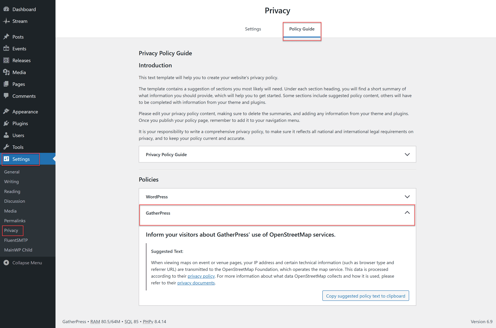

# Update your privacy policy

Inform your visitors about GatherPress\' use of third-party services.

>Every plugin that collects, uses, or stores user data, or passes it to an external source or third party, should add a section of suggested text to the privacy policy postbox. This is best done with `wp_add_privacy_policy_content( $plugin_name, $policy_text )`.
>
>This will allow site administrators to pull that information into their site’s privacy policy.
>
>Source: [WordPress Plugin Handbook](https://developer.wordpress.org/plugins/privacy/suggesting-text-for-the-site-privacy-policy/)

GatherPress is following this best-practice and offers some text suggestions, you may want to add to your privacy policy. This makes it easy to copy & paste the relevant snippets into your policy.

With the help of contributors this prepared text may even be already translated into your language.



Go to `Settings > Privacy > Policy Guide` to find a new '*GatherPress*' dropdown in the 'Policies' list

## Event update emails and GDPR consent

GatherPress can [email members about event updates](./emails.md). Out of the box, every user is treated as **opted in** to these emails until they uncheck "*Yes, I want to receive updates and information about events from the organizers.*" in the **Notifications** section of their user profile.

The GDPR — the European Union's privacy regulation, known in Germany as the DSGVO — requires affirmative consent for this kind of communication. An opt-out default generally does not qualify, so if your site operates under the GDPR or a similar privacy law, you should flip the default so users are **opted out** until they actively opt in:

```php
add_filter( 'gatherpress_event_updates_default_opt_in', static function () {
    return '0';
} );
```

Drop the snippet into a must-use plugin, a site-specific plugin, or your theme's `functions.php`.

The filter only controls the default for users who have never touched the setting — anyone who has explicitly saved a preference in their profile keeps it. See the [`gatherpress_event_updates_default_opt_in`](../developer/hooks/gatherpress_event_updates_default_opt_in.md) hook reference for details.

## Redacting RSVP IP addresses and user agents

RSVPs are stored as WordPress comments, so the visitor's IP address and browser user agent are recorded by default. To help comply with GDPR/DSGVO or other privacy regulations, you can redact this information with the same WordPress-native filters that apply to regular comments:

```php
add_filter( 'pre_comment_user_ip', static function () {
    return '127.0.0.1';
} );

add_filter( 'pre_comment_user_agent', static function () {
    return '';
} );
```

Drop the snippet into a must-use plugin, a site-specific plugin, or your theme's `functions.php`. It applies to all RSVP paths — form submissions, REST/AJAX submissions, and waiting-list promotions.

The same mechanism exposes the rest of WordPress's comment-data filters to RSVPs, should you want to sanitize or override them:

- `pre_comment_author_name`
- `pre_comment_author_email`
- `pre_comment_author_url`
- `pre_comment_content`
