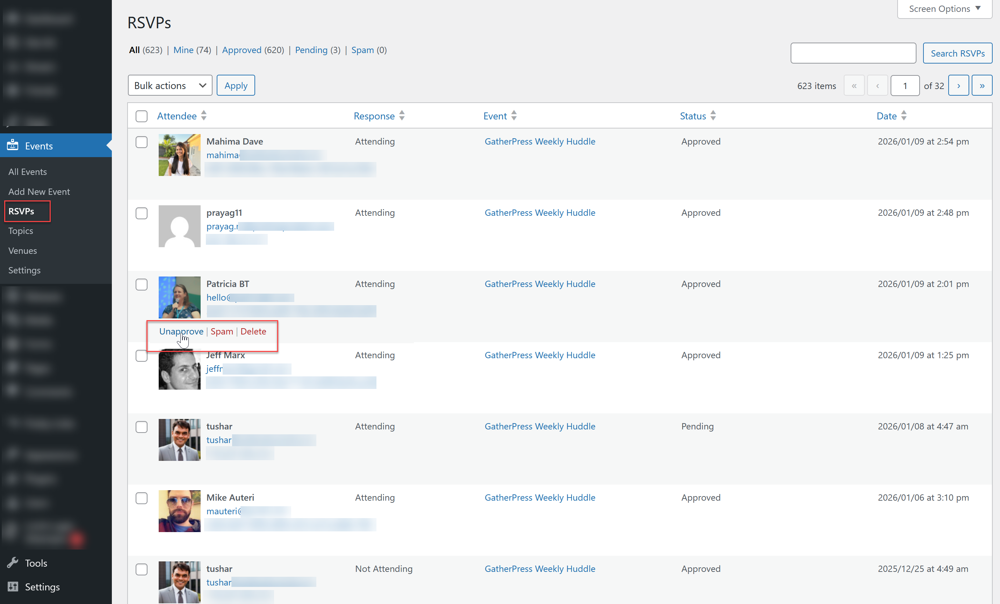
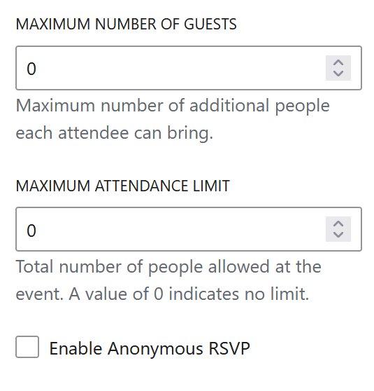

# RSVP system

This section explains how RSVPs work from both the visitor and organizer perspectives.

## RSVP functionality

RSVPs are configured per event.

What is known and visible in the UI:

* The presence of the RSVP block allows users to RSVP  
* Default RSVP behavior comes from GatherPress settings.  
* Event-level settings override global defaults.

## RSVP without an account

This feature is under development and requires, for now, manual addition of a RSVP Form in the RSVP modal content. This allows visitors to RSVP without an account, and triggers an email handshake with a confirmation link sent to the visitor. The RSVP is only confirmed after the link is clicked or if an administrator approves the RSVP.

## Managing RSVPs

Event organizers can manage RSVPs from the WordPress admin.

What is visible:

* A list of RSVPs per event.  
* Attendee status (yes / no / waiting list, if applicable).  
* Ability to approve, unapprove, delete or mark as spam manually when hovering, same as comments.
* if a red dot appears in the RSVP column, it means the RSVP is pending.

## Capacity and limits

Events can define attendance limits.

What is confirmed:

* Total number of people allowed at the event. A value of 0 indicates no limit.  
* A maximum number of guests per attendee can be set.  
* Defaults come from global settings.

What happens when an event is full:

* New RSVPs are prevented once the limit is reached.  
* A waiting list may be used if enabled. If enabled and someone is on a waiting list and a spot opens up, they are moved to attending. For now, no email is sent.

## Anonymous RSVP

If checked, visitors will be able to select "List me as anonymous". Their name and avatar will then not be publicly displayed, but admin users will still know their name and email addresses.