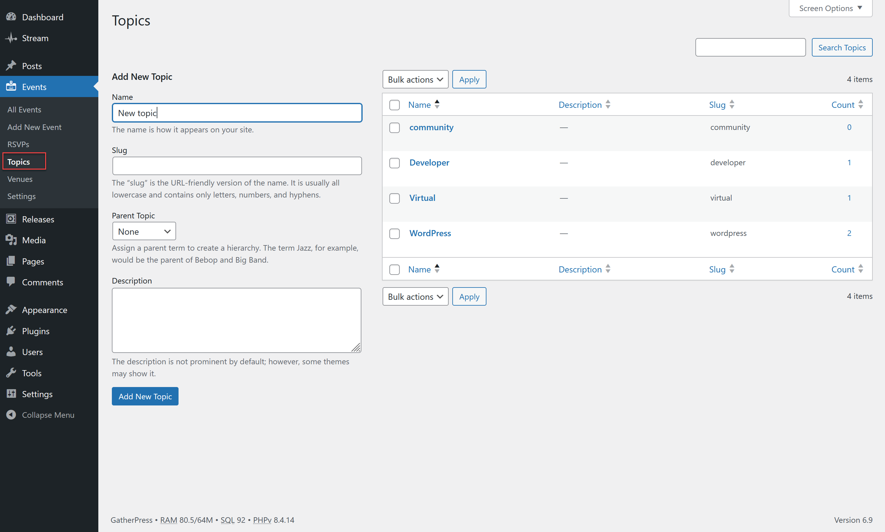

# Topics

Topics are used by GatherPress to categorize your events as a standard taxonomy feature. They work like Post categories and are hierarchical (you can define parent-child topics).

You can create topics under `Events > Topics` and these can then be selected for your events.

