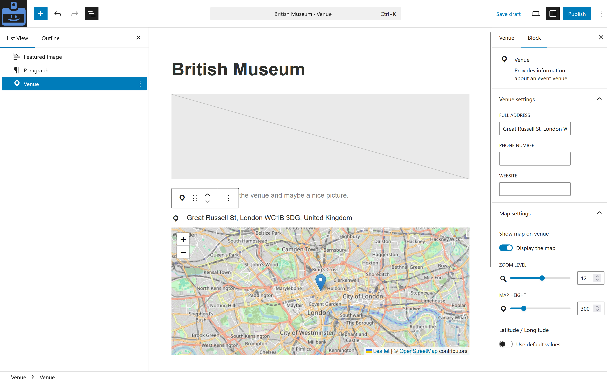

# Venues

Venues define *where* an event takes place. They are managed separately so they can be reused across multiple events.

Note: For the next version, 0.34, the venue blocks are going to be completely redeveloped and there will be a new Venue Query block.
## Creating venues

Venues can be created from `Events > Venues > Add New` in the WordPress admin.

The Venue block allows you to add/edit:

- A title (the venue name)
* Full address  
* Phone number  
* Website  
* Whether you want to display the map, with its zoom level and map height  
* Latitude / Longitude are filled by default, but you can use custom ones

Standard content blocks allow you to add any other content.

Note:

* A venue does not need to be assigned to an event immediately.

## Venue reuse

Venues are designed to be reusable. Updating a venue updates in all events that reference it.

What this allows:
* Use the same venue for recurring events.  
* Maintain a single source of truth for venue details.

## Venue display

Venue information is displayed on its own page, or in an event to which that specific venue has been assigned.

You can have an hybrid event with a physical venue and an online link. For this, you need to add both the Online event block and the Venue block in the event.