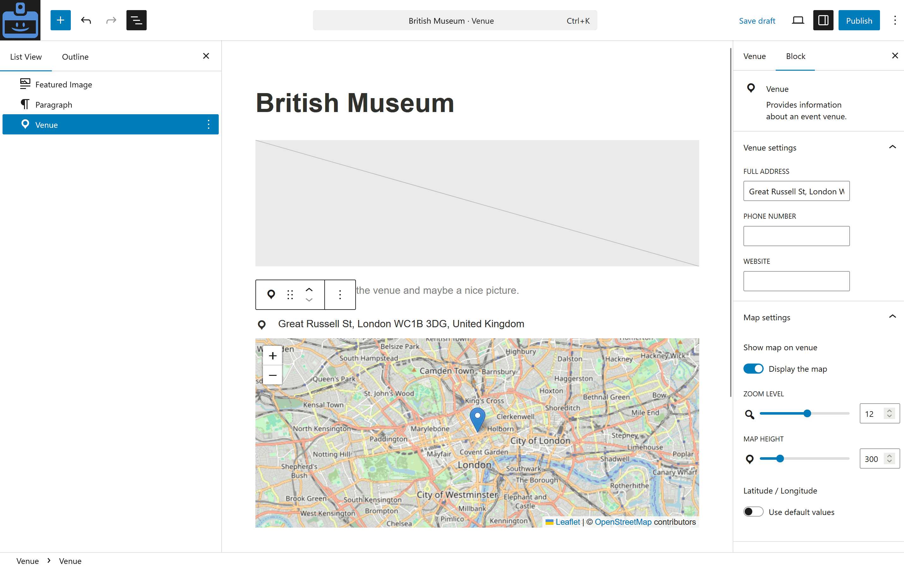

# Venues

Venues define *where* an event takes place. They are managed separately so they can be reused across multiple events.

Note: For the next version, 0.34, the venue blocks are going to be completely redeveloped and there will be a new Venue Query block.

## Creating venues

Venues can be created from `Events > Venues > Add New` in the WordPress admin.

The Venue block allows you to add/edit:

- A title (the venue name)
- Full address  
- Phone number  
- Website  
- Whether you want to display the map, with its zoom level and map height  
- Latitude / Longitude are filled by default, but you can use custom ones

Standard content blocks allow you to add any other content.

Note:

- A venue does not need to be assigned to an event immediately.

## Venue reuse

Venues are designed to be reusable. Updating a venue updates in all events that reference it.

What this allows:

- Use the same venue for recurring events.
- Maintain a single source of truth for venue details.

## Venue display

Venue information is displayed on its own page, or in an event to which that specific venue has been assigned.

You can have an hybrid event with a physical venue and an online link. For this, you need to add both the Online event block and the Venue block in the event.

## Venue map

Every venue with a real address ships with a map, rendered in one of two modes set on the Venue Map block:

- **Interactive** — a live, pan-and-zoom map powered by Leaflet (OpenStreetMap) or Google Maps, depending on the mapping platform you pick under `Settings > GatherPress > Venues > Maps`. Requires JavaScript on the visitor's side.
- **Static image** — a pre-rendered PNG of the map, composited server-side from OpenStreetMap tiles on the first save and cached under `wp-content/uploads/gatherpress/static-maps/`. No JavaScript required, which makes it the right choice for email previews, reader modes, cached HTML, and visitors who block scripts. Attribution for OpenStreetMap and CartoDB is rendered alongside the image automatically.

The block's inspector sidebar lets you pick the render mode, zoom level (1–20), width (100–1600 px or auto), height (100–800 px or auto), and aspect ratio (2:1 default, 16:9, 3:2, 4:3, 1:1, or a custom value like `21/9`). Leaving width or height on `0` means "auto" — the missing side is derived from the aspect ratio so the block keeps its shape when the container shrinks. Dragging the resize handles on the block canvas updates both dimensions; holding the preset aspect-ratio value locks the drag to that ratio. You can mix modes across events — one event can show the static image, another the interactive map, both pointing at the same venue.

### Linking the static image

Static maps can be wrapped in a link from the Inspector's **Link settings** panel (static mode only; the interactive map already owns pan-and-zoom interactions). The "Link to" dropdown offers four options:

- **None** — no link wrapper.
- **OpenStreetMap** — sends visitors to `openstreetmap.org` centered on the venue's coordinates at the block's zoom level.
- **Google Maps** — same idea, `google.com/maps`.
- **Custom URL** — free-form URL input. Use this for anything else (a venue's parking page, a ticket link, etc.).

Two toggles apply to any link destination except "None":

- **Open in new tab** — adds `target="_blank"` and auto-appends `rel="noopener noreferrer"` for safety.
- **Link rel** — free-form space-separated tokens that ride alongside the automatic ones, e.g. `nofollow sponsored`.

### Sitewide defaults

`Settings > GatherPress > Venues > Maps` exposes four defaults that apply to newly inserted Venue Map blocks:

- **Default Render Mode** — interactive or static image.
- **Default Zoom Level** — 1 (world) to 20 (street).
- **Default Height** — in pixels.
- **Default Map Type** — roadmap, satellite, hybrid, or terrain (Google Maps only; OpenStreetMap and static images ignore this).

Changing a default only affects blocks added afterwards — existing blocks keep the values the editor chose at insertion time, so a sitewide change never rewrites published content.

### Regeneration

Static images regenerate automatically when any input the image depends on changes — venue address, coordinates, zoom level, or block height. Each `(zoom, height)` combination is cached separately, so two events showing the same venue at different sizes each get a crisp PNG. Old images are cleaned up when the venue is updated or deleted.

### Privacy of static map URLs

Because static maps live under `wp-content/uploads/gatherpress/static-maps/`, anyone with the direct URL can fetch one — the same is true of any image in your uploads directory. To keep those URLs from being guessable, each filename includes a random per-venue salt generated the first time a map is rendered; two different venues at the same address produce different filenames. If you need stronger isolation (for example, venues whose coordinates should stay hidden until the event is public), restrict access to the static-maps subdirectory with an `.htaccess` or Nginx rule, or keep the venue unpublished until you're ready.
