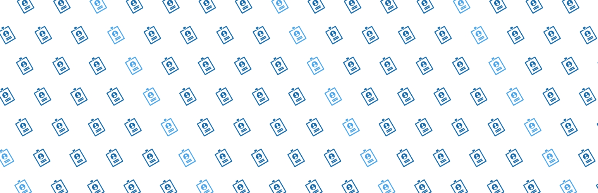
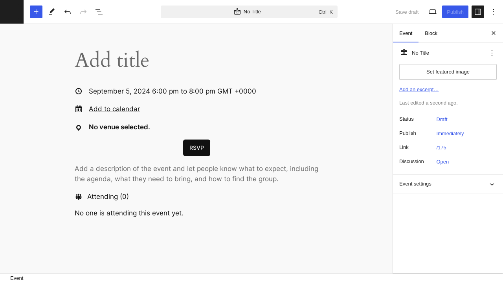
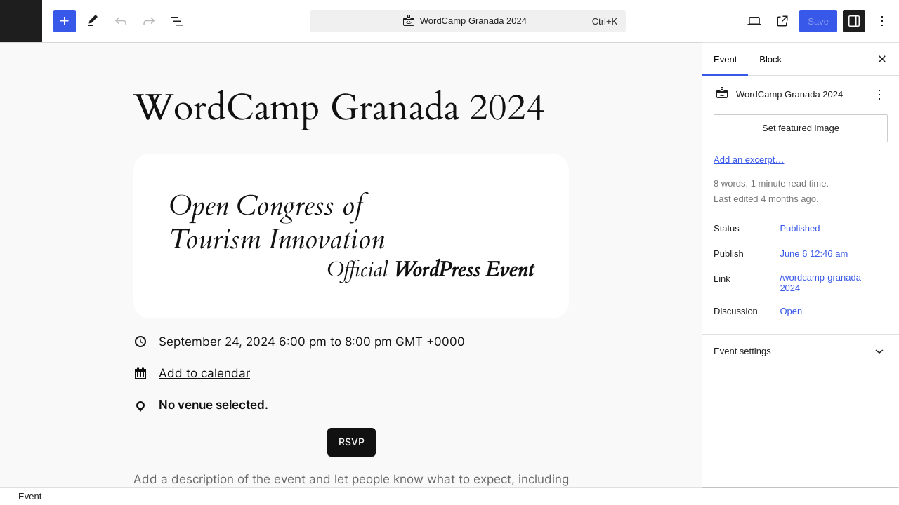

# GatherPress

Stable tag: 0.33.3  
Tested up to: 6.9  
License: GPL v2 or later  
Tags: events, event, meetup, community  
Contributors: mauteri, patricia70, hrmervin, jmarx75, stephenerdelyi, carstenbach, jordanpak, mahimadave, tusharaddweb, pkbhatt, andremenrath, apermo, dd32, passoniate, pbrocks

<!-- markdownlint-disable-next-line MD045 -->

**GatherPress** is a flexible, community-powered event management plugin for WordPress.

      

 

    

  

## 💡 Features

- Event scheduling (date, time, location, description)
- Attendee registration (with optional anonymous listing)
- Open RSVP support (non-logged-in users)
- Attendees can bring guests
- Email notifications for attendees and non-attendees
- Online and in-person event support (with mapping)
- Full block editor support
- Multisite-ready and fully internationalized

👉 See the [full feature list](https://github.com/GatherPress/gatherpress/blob/main/docs/features.md)
👉 Explore [upcoming features](https://github.com/GatherPress/gatherpress/blob/main/docs/roadmap.md)

---

## 🚀 Quick Start

### Install from WordPress.org

1. Go to **Plugins > Add New**
2. Search for `GatherPress`
3. Click **Install**, then **Activate**

### Or Install from GitHub

Download the latest `.zip` from the [Releases page](https://github.com/GatherPress/gatherpress/releases), then upload it to your WordPress dashboard under **Plugins > Add New > Upload Plugin**.

📖 [View installation guide](https://github.com/GatherPress/gatherpress/blob/main/docs/installation.md)
🛠️ [View configuration guide](https://github.com/GatherPress/gatherpress/blob/main/docs/configuration.md)

---

## 🧪 Try It Instantly

Use our [Playground Environment](https://playground.wordpress.net/?blueprint-url=https://raw.githubusercontent.com/GatherPress/gatherpress/main/.wordpress-org/blueprints/blueprint.json) to test GatherPress with real data — no setup required!

📺 [Watch the intro demo](https://gatherpress.org/demovideo)
🧪 [Learn more about Playground](https://github.com/GatherPress/gatherpress/blob/main/docs/playground.md)

---

## 🤝 Get Involved

GatherPress is built by and for the community — contributions are always welcome.

- 🧠 Read the [Developer Docs](https://github.com/GatherPress/gatherpress/tree/develop/docs/developer)
- 🛠️ Check out [open issues](https://github.com/GatherPress/gatherpress/issues)
- 💬 Join us on [WordPress Slack](https://make.wordpress.org/chat/) or [GatherPress.org](https://gatherpress.org/get-involved)

📖 [Contributor Guide](https://github.com/GatherPress/gatherpress/blob/main/docs/contributing.md)

---

## 🛠️ Third-Party Libraries

- [Leaflet](https://leafletjs.com/) — interactive maps for venues
- [React-Modal](https://github.com/reactjs/react-modal) — modal dialogs *(currently in use, but being phased out)*
- [React-Tooltip](https://github.com/wwayne/react-tooltip) — tooltips *(currently in use, but being phased out)*

---

## 📸 Screenshots

1. Creating a new event
   
2. Editing an event
   
3. Settings screen
   

---

## ℹ️ More Information

- [Changelog](https://github.com/GatherPress/gatherpress/releases)
- [Frequently Asked Questions](https://github.com/GatherPress/gatherpress/blob/main/docs/faq.md)
- [Alpha plugin info](https://github.com/GatherPress/gatherpress-alpha)

---

*GatherPress is still in active development. Thank you for helping us build a better way to gather.*
