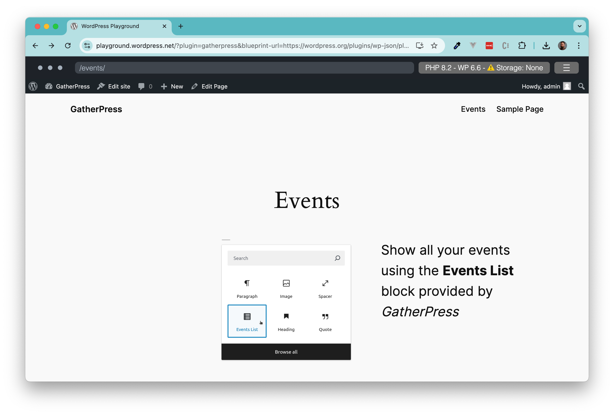
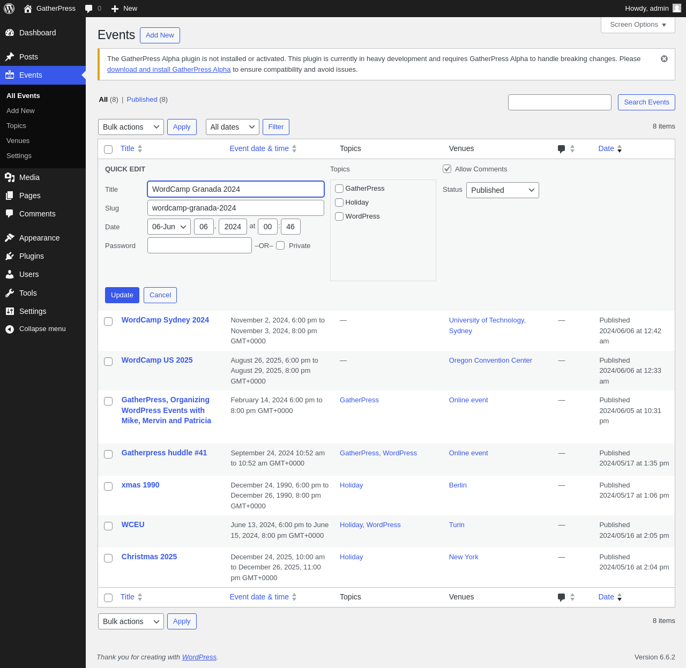
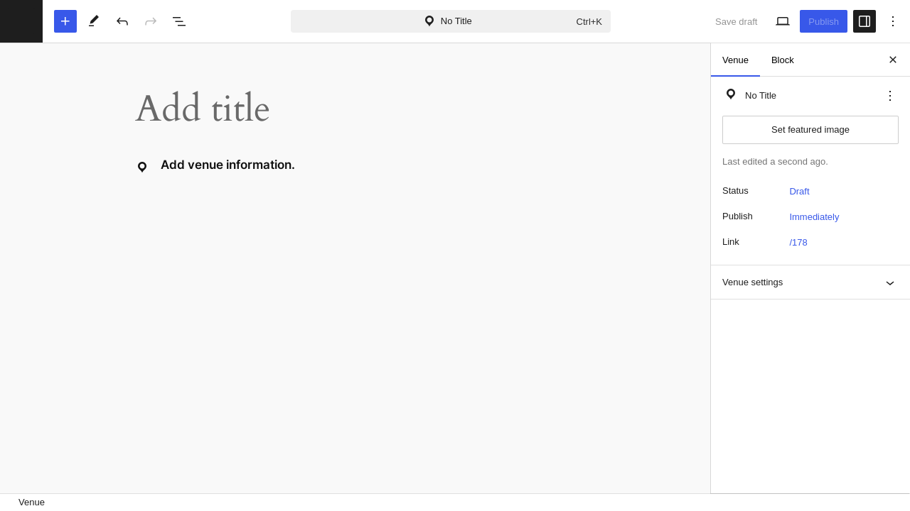

# GatherPress

Stable tag: 0.31.0  
Tested up to: 6.6.2  
License: GPL v2 or later  
Tags: events, event, meetup, community  
Contributors: mauteri, hrmervin, patricia70, carstenbach, jmarx75, stephenerdelyi, calebthedev, pbrocks

<!-- markdownlint-disable-next-line MD045 -->

GatherPress, powering our community's event management needs.

      

 

    

  

## Description

GatherPress, a plugin created by and for the WordPress community, is a response to the community's desire for novel event management tools that meet the diverse needs of event organizers and members. Its agenda and roadmap align with that of the WordPress community, ensuring that it evolves in tandem with our collective wants and needs.

## Pilot Program

**We propose a pilot program to test GatherPress**, a community-developed plugin, within interested and active WordPress meetup groups. This initiative stems from our community’s need for an innovative event management tool tailored to the unique demands of WordPress event organizers and participants. Our proposal in January 2024 on [make.wordpress.org](https://make.wordpress.org/community/2024/01/22/proposal-pilot-program-to-test-gatherpress-on-the-wordpress-org-network-as-a-meetup-alternative/)

## Community-built

This project is the result of a collaborative effort to build a compelling event management application using open source tools such as _WordPress_ and _BuddyPress_ and with the grit, sweat, and love of **the community, for the community**. We encourage all interested, whether a user, community member, or developer, to follow our emerging presence on our [GatherPress Blog](https://gatherpress.org/blog/), our [GitHub repositories](https://github.com/GatherPress/), our [GatherPress Documentation](https://gatherpress.org/documentation/), or new features on our [GatherPress Playground](https://wordpress.org/plugins/gatherpress/?preview=1).

## Playground Environment

The GatherPress Playground allows you to test the current state of GatherPress with existing data in a fully-functional environment.

The playground is built on the WordPress Playground with customizable json data that you can customize as you like. To get started, click the [button above](https://wordpress.org/plugins/gatherpress/?preview=1), or delve deeper by:

- Clicking the “Live Preview” button on WordPress.org GatherPress plugin page
- Instantly previewing changes from a commented Playground-link on each PR
- Automatically generating multilingual screenshots for WordPress.org plugins
- Run end-to-end tests (still a PR)
- Curating and maintaining your own set of demo-data, which is reusable in all WP Playgrounds.

For an introduction as to what we are creating and the specific features needed to host events and gather well, please view the [introductory video](https://gatherpress.org/demovideo).

<!-- markdownlint-disable-next-line MD034 -->
https://www.youtube.com/watch?v=BnYS36C5d38&t=2s

### Features

- Event Scheduling: set dates, times, and provide event information details.
- Attendee registration.
- Allow attendees to add guests.
- Ability for attendees to be listed anonymously (only administrators will see their names).
- Emailing system: to send emails to all the group members, or a specific event attendees, non-attendees, and those on the waiting list.
- In person events: add the venue, with an optional map (refer to point 4)
- Online event management: add the video meeting URL.
- Multi-event management: capability to handle multiple events simultaneously.
- Multisite environment: This setup allows for centralized management while providing flexibility for each site to host its own unique events with its settings (language, timezone, date time format) and set of users.
- Works with blocks.
- Fully internationalized.
- Freedom to add content besides the default event/venue blocks, to remove default blocks, and add synced patterns (useful for adding consistent information across all events).

### Upcoming features

- Import events from meetup.com with an add-on plugin. ([#](https://github.com/GatherPress/gatherpress/issues/394))
- Recurring events. ([#](https://github.com/GatherPress/gatherpress/issues/80))
- Calendar block. ([#](https://github.com/GatherPress/gatherpress/issues/369))
- Email notification when event starts. ([#](https://github.com/GatherPress/gatherpress/issues/429))
- Event federation using ActivityPub ([#](https://github.com/GatherPress/gatherpress/issues/569))

### Third-Party Libraries

This plugin leverages the following third-party libraries for various functionalities:

- [React-Modal](https://github.com/reactjs/react-modal): Facilitates the creation of modal dialogs in React components.
- [React-Tooltip](https://github.com/wwayne/react-tooltip): Provides customizable tooltips for React applications.
- [Leaflet](https://leafletjs.com/): Provides global, open-source mapping functionality

## Installation

### Installation from the WordPress repository

GatherPress is now available on the WordPress plugins repository and able to be installed like any other plugin.

1. Navigate to your site's wp-admin area, and in the left-side menu click on Plugins > Add new plugin.
2. Search for `gatherpress` in the search box and click the Install button.
3. Activate the plugin.

### Installation from GitHub

Since this plugin is in active development by the community, features and functionality are still evolving. For the latest updates to GatherPress, consult our [GitHub page](https://github.com/GatherPress/).

1. To find the latest release for installation, use the link under [Releases](https://github.com/GatherPress/gatherpress/releases) > Assets to download `gatherpress.zip`.
2. Then go to your wp-admin plugins page and click on the `Upload Plugin` button.
3. Click on the `Choose File` button at the center of your screen to select the `gatherpress.zip` file you just downloaded.
4. Select the proper zip file, click Open, then `Install Now`.
5. Activate the plugin.

### Requirements

To run GatherPress, we recommend your host supports:

- PHP version 7.4 or greater.
- MySQL version 5.6 or greater, or, MariaDB version 10.0 or greater.
- HTTPS support.

## Configure GatherPress

In WP Admin, go to `Events`  > `Settings`.

You can change different settings such as:

- Show publish date as event date for events.
- The default maximum limit of attendees to an event.
- Anonymous RSVP.
- Date Format.
- Time Format.
- Display the timezone for scheduled events.
- Upcoming Events page.
- Past Events page.

### Create an Event

In WP Admin, go to `Events` > `Add New`.

By default, a few blocks are populated, you can keep them or delete them and you can add more blocks.

- The Event date block allows you to define the start and end dates and times of your event, as well as the timezone.
- The Add to Calendar block enables your users to add the event to their preferred calendar directly from the published event on the frontend.
- The Venue block lets you choose whether your event is online or in a venue. You can select the venue (refer to point 4) and the map settings: display, zoom level, type of map and map height.
- The RSVP block enables members to confirm they attend or do not attend an event.
- The description of the event is a normal paragraph block. You can add anything with any block here.
- The RSVP Response block displays a list of members who have confirmed they attend or do not attend an event.
- The event settings allow you to modify all the above mentioned settings, enable or disable anonymous RSVP, choose Topics, notify members or attendees, as well as standard WordPress settings such as the featured image, the excerpt, allow or disallow comments, etc.

### Create a Venue

In WP Admin, go to `Events` > `Venues`.

In the Venue block, you can define:

- The full address, telephone, and website of the venue.
- The map settings.

### Create an Event Topic

In WP Admin, go to `Events`  > `Topics`.

Topics are like post categories, but for events.

## Contribute

If you wish to share in the collaborative of work to build _GatherPress_, please drop us a line either via [WordPress Slack](https://make.wordpress.org/chat/) or on [GatherPress.org](htps://gatherpress.org/get-involved). The development location of the GatherPress project can be found at [https://github.com/gatherpress/gatherpress](https://github.com/gatherpress/gatherpress). All contributions are welcome: code, design, user interface, documentation, translation, and more.

### Read Developer Documentation

Find the developer documentation inside the plugins' `docs` folder or on our [website](https://gatherpress.org/documentation/). our intent is to sync the `docs` folder to the website documentation.

### Collaborator Access

To get write access to the GitHub repo, please reach out to our **GitHub Administrators**: [Mervin Hernandez](https://github.com/MervinHernandez) and [Mike Auteri](https://github.com/mauteri).

To get access to [GatherPress.org](htps://gatherpress.org/get-involved) via SSH or WP Admin login, please reach out to our **GatherPress.org Administrator**: [Mervin Hernandez](https://github.com/MervinHernandez).

## Frequently Asked Questions

### What external services are used in GatherPress?

- Mapping Services: We use OpenStreetMap and Google Maps to display meeting locations on a map. To achieve this, we send the address to OpenStreetMap or Google Maps for rendering.
- Calendar Integration: GatherPress also supports "Add to Calendar" functionality using Google Calendar and Yahoo! Calendar.

### What about a PRO version?

As a Community powered plugin, GatherPress is already the PRO-version.

Because we strive for close-to-core development, love decisions - not options and follow a lot of well known best-practices within the WordPress space, we can and do focus on what matters most - powering our community's event management needs.

### Is GatherPress WordPress Multisite compatible?

Yes, GatherPress can be run on a network of sites. The additional database tables it needs, will be created automatically for each new site if the plugin is network-activated.

GatherPress can also be activated per site.

## GatherPress‘ Best Practices

- Tested & validated against [WordPress Coding Standards](https://developer.wordpress.org/coding-standards/wordpress-coding-standards/)
- Not only once, but consequently tested & validated against the [WordPress plugin review guidelines](https://github.com/WordPress/plugin-check-action).
- [JavaScript & PHP Unit tests](https://sonarcloud.io/summary/new_code?id=GatherPress_gatherpress&branch=main) are covering almost 80% of the whole codebase.

## Reminder -- GatherPress is still in Alpha

As we continue to refine and develop the core plugin, we've created the [GatherPress Alpha](https://github.com/GatherPress/gatherpress-alpha) plugin to run alongside the GatherPress plugin. The role of the Alpha plugin is to manage breaking changes easily: just make sure it is up-to-date, activate it, go to the Alpha section under GatherPress Settings, and click "Fix GatherPress!" after updating GatherPress. This process helps us avoid technical debt as we work towards launching version 1.0.0 of the plugin. When we arrive there, the Alpha plugin will no longer be necessary.

## Screenshots

1. Create a new event
   
2. Edit an event
   
3. Quick Edit an event
   
4. Create a new venue
   
5. General Settings
   
6. Leadership Settings
   

## Changelog

See complete changelog at [https://github.com/GatherPress/gatherpress/releases](https://github.com/GatherPress/gatherpress/releases).
